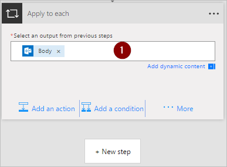
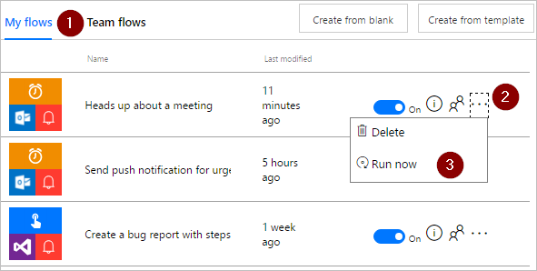

# Usar la acción aplicar a cada de Microsoft Flow para procesar una lista de elementos periódicamente
[!INCLUDE [view-pending-approvals](includes/cc-rebrand.md)]
Muchos desencadenadores pueden iniciar inmediatamente un flujo en función de un evento, como cuando llega un nuevo correo electrónico en la bandeja de entrada. Estos desencadenadores son excelentes, pero a veces desea ejecutar un flujo que consulta a un origen de datos según una programación predefinida, realizando ciertas acciones en función de las propiedades de los elementos del origen de datos. Para ello, el flujo se puede iniciar según una programación (por ejemplo, una vez al día) y usar una acción de bucle como **aplicar a cada** una de ellas para procesar una lista de elementos. Por ejemplo, puede usar **Apply to Each** para actualizar registros de una base de datos o una lista de elementos de Microsoft SharePoint.

En este tutorial, vamos a crear un flujo que se ejecuta cada 15 minutos y hace lo siguiente:

1. Obtiene los últimos 10 mensajes sin leer de la bandeja de entrada de Office 365 Outlook.
2. Comprueba cada uno de los 10 mensajes para confirmar si alguno de ellos se ha **cumplido ahora** en el asunto.
3. Comprueba si el correo electrónico procede de su jefe o se envió con importancia alta.
4. Envía una notificación de envío y marca como leída cualquier correo electrónico que se haya **cumplido ahora** en el asunto y que sea de su jefe o se haya enviado con importancia alta.

En este diagrama se muestran los detalles del flujo que crearemos en este tutorial:

## Requisitos previos
Estos son los requisitos para realizar correctamente los pasos de este tutorial:

* Una cuenta registrada para usar [Microsoft Flow](https://flow.microsoft.com).
* Una cuenta de Office 365 Outlook.
* La aplicación móvil Microsoft Flow para [Android](https://aka.ms/flowmobiledocsandroid), [iOS](https://aka.ms/flowmobiledocsios)o [Windows Phone](https://aka.ms/flowmobilewindows).
* Conexiones con Office 365 Outlook y el servicio de notificaciones de extracción.

## Creación de un flujo
1. Inicie sesión en [Microsoft Flow](https://flow.microsoft.com):
2. Seleccione la pestaña **Mis flujos** y, después, cree un flujo desde un espacio en blanco:
   
    
3. Escriba "programación" en el cuadro de búsqueda para buscar todos los servicios y desencadenadores relacionados con la programación.
4. Seleccione el desencadenador **programación-periodicidad** para indicar que el flujo se ejecutará según una programación que se va a proporcionar a continuación:
   
    
5. Establecer la programación para que se ejecute cada 15 minutos:
   
    
6. Seleccione **+ nuevo paso**, **Agregar una acción**y, a continuación, escriba **Outlook** en el cuadro de búsqueda para buscar todas las acciones relacionadas con Microsoft Outlook.
7. Seleccione la acción **Office 365 Outlook-obtener correos electrónicos** :
   
    
8. Se abrirá la tarjeta **obtener correos electrónicos** . Configure la tarjeta **obtener correos electrónicos** para seleccionar los 10 correos electrónicos no leídos principales en la carpeta Bandeja de entrada. No incluya datos adjuntos porque no se usarán en el flujo:
   
    
   
   > [!NOTE]
   > Hasta ahora, ha creado un flujo sencillo que obtiene algunos mensajes de correo electrónico de su bandeja de entrada. Estos mensajes de correo electrónico se devolverán en una matriz; la acción **aplicar a cada** requiere una matriz, por lo que es exactamente lo que se necesita.
   > 
   > 

## Agregar acciones y condiciones
1. Seleccione **+ nuevo paso**, **más**y, a continuación, **agregue una acción aplicar a cada uno** :
   
    
2. Inserte el token de **cuerpo** en el cuadro **Seleccione una salida de los pasos anteriores** de la tarjeta **aplicar a cada** . Esto extrae el cuerpo de los correos electrónicos que se usarán en la acción **aplicar a cada uno** :
   
    
3. Seleccione **Agregar una condición**:
   
    
4. Configure la tarjeta **condición** para buscar las palabras "reunirse ahora" en el asunto de cada correo electrónico:
   
   * Inserte el token de **asunto** en el cuadro **nombre de objeto** .
   * Seleccione **Contains** en la lista **relación** .
   * Escriba **reunirse ahora** en el cuadro **valor** .
     
     
5. Seleccione **más**y, a continuación, seleccione **Agregar una condición** en la rama en **caso afirmativo, no hacer nada** . Se abrirá la tarjeta de la **condición 2** ; Configure esa tarjeta como esta:
   
   * Inserte el token de **importancia** en el cuadro **nombre de objeto** .
   * Seleccione **es igual a** en la lista **relación** .
   * Escriba **alto** en el cuadro **valor** .
     
     
6. Seleccione **Agregar una acción** en la sección en **caso afirmativo, no hacer nada** . Se abrirá la tarjeta **elegir una acción** , donde podrá definir qué debe ocurrir si la condición de búsqueda (el correo electrónico **meet Now** se envió con importancia alta) es true:
   
    
7. Busque **notificación**y, después, seleccione la acción **notificaciones-enviarme una notificación por móvil** :
   
    
8. En la tarjeta **enviarme una notificación por móvil** , proporcione los detalles de la notificación de envío que se enviará si el asunto de un correo electrónico contiene "reunirse ahora" y, a continuación, seleccione **Agregar una acción**:
   
    
9. Escriba **leer** como término de búsqueda y, a continuación, seleccione la acción **Office 365 Outlook-marcar como leído** . Esto marcará cada correo electrónico como leído después de enviar la notificación de envío:
   
    
10. Agregue el token de ID. de **mensaje** al cuadro **ID** . de mensaje de la tarjeta **marcar como leído** . Es posible que tenga que seleccionar **Ver más** para encontrar el token de ID. de **mensaje** . Indica el identificador del mensaje que se marcará como leído:
    
     
11. Volver a la tarjeta de la **condición 2** , en la rama **si no, no hacer nada** :
    
    * Seleccione **Agregar una acción**y, a continuación, escriba **obtener administrador** en el cuadro de búsqueda.
    * Seleccione la acción **Office 365 usuarios-obtener administrador** de la lista de resultados de la búsqueda.
    * Escriba la dirección de correo electrónico *completa* en el cuadro **usuario** de la tarjeta **obtener administrador** .
      
      
12. Seleccione **más**y, a continuación, seleccione **Agregar una condición** de la rama **si no** . Se abrirá la tarjeta **condición 3** . Configure la tarjeta para comprobar si la dirección de correo electrónico del remitente del correo electrónico (el token de) es la misma que la dirección de correo electrónico de su jefe (el token de correo electrónico):
    
    * Inserte el token **desde** en el cuadro Nombre de **objeto** .
    * Seleccione **Contains** en la lista **relación** .
    * Escriba token de **correo electrónico** en el cuadro **valor** .
      
      
13. Seleccione **Agregar una acción** en la sección en **caso afirmativo, no hacer nada** de la tarjeta **condición 3** . Se abrirá la tarjeta **si es Yes** , donde podrá definir qué debe ocurrir si la condición de búsqueda (el correo electrónico se envió desde su jefe) es verdadera:
    
     
14. Busque **notificación**y, después, seleccione la acción **notificaciones-enviarme una notificación por móvil** :
    
     
15. En la tarjeta **enviarme una notificación de Mobile 2** , proporcione los detalles de la notificación de envío que se enviará si el correo electrónico procede de su jefe y, a continuación, seleccione **Agregar una acción**:
    
     
16. Agregue la acción **Office 365 Outlook-marcar como leído** . Esto marcará cada correo electrónico como leído después de enviar la notificación de envío:
    
     
17. Agregue el token de ID. de **mensaje** a la **marca como tarjeta de lectura 2** . Es posible que tenga que seleccionar **Ver más** para encontrar el token de ID. de **mensaje** . Indica el identificador del mensaje que se marcará como leído:
    
     
18. Asigne un nombre al flujo y, a continuación, créelo:
    
     

Si ha seguido estos pasos, el flujo debe ser similar a este diagrama:

## Ejecución del flujo
1. Envíese a sí mismo un correo electrónico de alta importancia que incluye **reunirse ahora** en el asunto (o que alguien de su organización le envíe un correo electrónico).
2. Confirme que el correo electrónico está en la bandeja de entrada y que no se ha leído.
3. Inicie sesión en Microsoft Flow, seleccione **Mis flujos**y, después, seleccione **Ejecutar ahora**:
   
    
4. Seleccione **Ejecutar flujo** para confirmar que realmente desea ejecutar el flujo:
   
    
5. Transcurridos unos instantes, debería ver los resultados de la ejecución correcta:
   
    

## Ver los resultados de la ejecución
Ahora que ha ejecutado el flujo correctamente, debe recibir la notificación de envío en el dispositivo móvil.

1. Abra la aplicación Microsoft Flow en el dispositivo móvil y, a continuación, seleccione la pestaña **actividad** . Verá la notificación de la extracción de la reunión:
   
    
2. Para ver el contenido completo de la notificación, es posible que tenga que seleccionar la notificación. Verá la notificación completa, similar a la siguiente:
   
    
   
   > [!NOTE]
   > Si no recibe la notificación de envío, confirme que el dispositivo móvil tiene una conexión de datos de trabajo.
   > 
   > 

