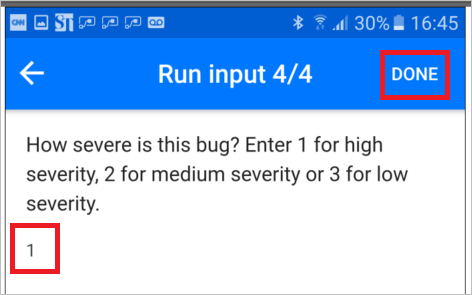
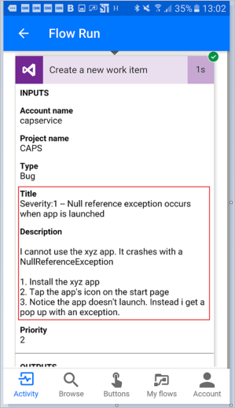

# Introducción de los flujos de botones con datos proporcionados por el usuario
[!INCLUDE [view-pending-approvals](includes/cc-rebrand.md)]
Cree un flujo de botones para ejecutar tareas rutinarias simplemente punteando un botón. Personalice el flujo permitiendo al usuario proporcionar detalles específicos que se usarán cuando se ejecute el flujo. Este tema le guía a través de la creación de un flujo de botones que toma la entrada del usuario y, a continuación, ejecuta el flujo de botones, resaltando cómo proporcionar la entrada del usuario.

Puede crear un flujo de botón en el sitio web de Microsoft Flow o en la aplicación móvil para Microsoft Flow. En este tema, usará el sitio Web.

### Requisitos previos
* Una cuenta en el sitio web de Microsoft Flow.

## Abrir la plantilla
1. Inicie sesión en el [sitio web de Microsoft Flow](https://flow.microsoft.com), escriba **Visual Studio** en el cuadro de búsqueda y, a continuación, haga clic o pulse en el icono de búsqueda para buscar todas las plantillas relacionadas con Visual Studio:
   
      
2. Seleccione la plantilla **abrir un error de prioridad 2 en Visual Studio** :
   
      
3. Seleccione **el botón usar esta plantilla** :
   
      
   
    Esta plantilla usa el Visual Studio Team Services (VSTS) y los servicios de notificaciones de extracción. Tendrá que iniciar sesión en estos servicios si no tiene una conexión a ninguno de ellos. El botón **iniciar sesión** solo aparecerá si necesita iniciar sesión en un servicio.
4. Después de iniciar sesión en todos los servicios necesarios, seleccione el botón **continuar** :
   
      
5. opta Cambie el nombre del flujo escribiendo un nombre de su elección en el cuadro de la parte superior del portal:
   
    

## Personalizar la entrada del usuario
1. En la tarjeta del desencadenador, seleccione **Editar**:
   
      
2. Seleccione el icono de **+** para expandir la página de forma que pueda agregar campos de entrada personalizados:
   
    
3. Escriba el **título** y la **Descripción** de entrada de cada campo personalizado que desee que esté disponible cuando alguien ejecute el flujo.  
   
    En este ejemplo, creará dos campos de entrada personalizados (**pasos de reproducción de errores** y **gravedad del error**) para que cualquier persona que use este flujo pueda escribir los pasos para reproducir el error y valorar la gravedad del error:  
   
    

## Personalizar el error
1. Puntee en la barra de título **crear una nueva** tarjeta de elemento de trabajo:
   
      
2. Realice las selecciones adecuadas para el entorno de VSTS y, después, seleccione **Editar**:
   
    Por ejemplo, conéctese a myinstance.visualstudio.com escribiendo **instanceof**.
   
      
3. Seleccione **Mostrar opciones avanzadas** para mostrar los otros campos de esta tarjeta:
   
      
4. Coloque el cursor delante del token del **título del error** y, a continuación, escriba "Severity:" en el campo de texto del **título** .
5. Con el cursor todavía en el campo de texto del título, seleccione el token **gravedad del error** y, a continuación, escriba "--".  
6. En el campo de texto **Descripción** , coloque el cursor justo después del token de **Descripción del error** y, a continuación, presione Entrar para iniciar una nueva línea.
7. Coloque el cursor en la nueva línea y, a continuación, seleccione el token de **pasos de reproducción de errores** :
   
    

## Personalización de la notificación de extracción
1. Puntee en la barra de título de la tarjeta **enviar una notificación de envío** para expandirla.
2. En la lista de tokens de contenido dinámico, seleccione **Ver más**y, a continuación, agregue el token de **dirección URL** en el campo de texto del **vínculo** .
3. En el campo de texto de **etiqueta de vínculo** , agregue el token de **identificador** :
   
      
4. Pulse en **Crear flujo** en el menú para crear el flujo:   

## Ejecutar el flujo
En este tutorial, usará la aplicación móvil de Microsoft Flow para ejecutar el flujo de botón que acaba de crear. Proporcionará todos los datos proporcionados por el usuario para crear un error con un título, una descripción, los pasos de reproducción y un nivel de gravedad.  

1. En la aplicación móvil de Microsoft Flow, puntee en la pestaña **botones** y, a continuación, puntee en el botón **crear informe de errores con pasos** .
   
      
2. Escriba el título del error que está notificando y, a continuación, puntee en **siguiente**. Por ejemplo:
   
      
3. Escriba la descripción del error que está notificando y, a continuación, puntee en **siguiente**. Por ejemplo:
   
      
4. Escriba los pasos para reproducir el error que está notificando y, a continuación, puntee en **siguiente**. Por ejemplo:
   
      
5. Escriba la gravedad del error que está notificando y, a continuación, pulse **listo**:  
      
   
    El flujo se ejecuta.
6. opta Puntee en la pestaña **actividad** para mostrar los resultados.
   
      
7. opta Para mostrar los resultados detallados de la ejecución del flujo, puntee en el paso **crear un nuevo elemento de trabajo** .
   
    

## Usar diferentes tipos de entrada

Los flujos de botón también pueden aceptar tipos de datos enriquecidos. Esta es la lista de tipos de entrada de datos que los flujos de botón aceptan: 

- Negrita
- Desplegables (como botones de radio)
- Dirección de correo electrónico
- Archivo (por ejemplo, una fotografía en el teléfono)
- Casilla sí o no
- Números
- Fecha (con un selector de calendario)

Para usar estos tipos de entrada, agregue el desencadenador **desencadenar manualmente un** desencadenador de flujo y, a continuación, agregue cualquiera de estos tipos al flujo:

Además, es posible que desee designar algunas entradas según sea necesario y otras como opcionales. Use el menú de acción (... en el lado derecho) en cada campo de entrada. Hay un límite de cinco entradas por botón.

## Pasos siguientes
* [Compartir flujos de botones](share-buttons.md)
* [Más información sobre los flujos de botón](introduction-to-button-flows.md)  
* [Más información sobre los flujos de botón con tokens de desencadenador](introduction-to-button-trigger-tokens.md)  

