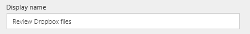

# Cree un bucle de aprobación mediante Microsoft Flow y Microsoft Common Data Service
[!INCLUDE [view-pending-approvals](includes/cc-rebrand.md)]
El Common Data Service puede proporcionarle una manera de compilar flujos que tengan información almacenada en una base de datos independiente de un flujo. El mejor ejemplo de esto es con aprobaciones. Si almacena el estado de la aprobación en una entidad, el flujo puede funcionar encima.

En este ejemplo, creará un proceso de aprobación que se inicia cuando un usuario agrega un archivo a Dropbox. Cuando se agrega el archivo, aparece información sobre él en una aplicación, donde un revisor puede aprobar o rechazar el cambio. Cuando el revisor aprueba o rechaza el cambio, se envía el correo de notificación y se eliminan los archivos rechazados de Dropbox.

Al seguir los pasos de esta sección, compilará:

* una **entidad personalizada** que contendrá información sobre cada archivo agregado a Dropbox y si el estado del archivo es aprobado, rechazado o pendiente.
* **flujo** que agrega información a la entidad personalizada cuando se agrega un archivo a Dropbox, envía correo cuando se aprueba o rechaza el archivo y elimina archivos rechazados. En estos pasos se muestra cómo crear este tipo de flujo desde cero, pero puede crear un flujo similar a partir de una plantilla.
* una **aplicación** en la que un revisor puede aprobar o rechazar archivos agregados a Dropbox. Usará PowerApps para generar esta aplicación automáticamente en función de los campos de la entidad personalizada.

**Requisitos previos**

* Regístrese en [Microsoft Flow](sign-up-sign-in.md) y [PowerApps](https://powerapps.microsoft.com/tutorials/signup-for-powerapps/).
* Cree conexiones a Dropbox y Office 365 Outlook, como se describe en [administrar las conexiones](https://powerapps.microsoft.com/tutorials/add-manage-connections/) .

## Compilar la entidad
1. Inicie sesión en [powerapps.com](https://web.powerapps.com).
2. Si la barra de navegación izquierda no aparece de forma predeterminada, haga clic o pulse en el icono con tres líneas horizontales en la esquina superior izquierda.
   
    
3. En la barra de navegación izquierda, pulse o haga clic en **administrar**y, después, pulse o haga clic en **entidades**.
   
    
4. Si se le solicita, pulse o haga clic en **crear mi base de datos**.
   
    
5. Cerca de la esquina superior derecha, pulse o haga clic en **nueva entidad**.
   
    
   
    Si la ventana del explorador no está maximizada, este botón podría aparecer en un lugar diferente.
6. En **nombre de entidad**, especifique un nombre que no contenga espacios y que no tenga ninguna otra entidad en la base de datos.
   
    Para seguir este ejemplo exactamente, especifique **ReviewDropboxFiles**.
   
    
7. En **nombre para mostrar**, especifique un nombre descriptivo.
   
    
8. Pulse o haga clic en **siguiente**.
   
    

## Agregar campos a la entidad
1. Cerca de la esquina superior derecha, pulse o haga clic en **Agregar campo**.
   
    
2. En la fila en blanco que aparece en la parte inferior de la lista de campos, establezca las propiedades de un campo de **aprobador** . (Al establecer estas propiedades, puede cambiar a la columna siguiente presionando TAB).
   
   * En la columna **nombre para mostrar** , escriba **aprobador**.
   * En la columna **nombre** , escriba **ApproverEmail**.
   * En la columna **tipo** , haga clic o pulse en la opción **correo electrónico** .
   * En la columna **requerido** , active la casilla.
     
     
3. En la fila siguiente, establezca las propiedades de un campo de **Estado** :
   
   * En la columna **nombre para mostrar** , escriba **status**.
   * En la columna **nombre** , escriba **status**.
   * En la columna **tipo** , haga clic o pulse en la opción **texto** .
   * En la columna **propiedades** , deje el valor predeterminado.
   * En la columna **requerido** , active la casilla.
     
     
4. En la fila siguiente, establezca las propiedades de un campo **FileID** :
   
   * En la columna **nombre para mostrar** , escriba identificador de **archivo**.
   * En la columna **nombre** , escriba **FileID**.
   * En la columna **tipo** , haga clic o pulse en la opción **texto** .
   * En la columna **propiedades** , deje el valor predeterminado.
   * En la columna **única** , active la casilla.
   * En la columna **requerido** , active la casilla.
     
     
5. Cerca del borde derecho, pulse o haga clic en los puntos suspensivos (...) del campo **FileID** y, después, pulse o haga clic en **establecer como campo de título**.
   
    
6. Cerca de la esquina inferior izquierda, pulse o haga clic en **crear**.
   
    
7. opta Cuando vuelva a aparecer la lista de entidades, maximice la ventana del explorador si aún no está maximizada y, a continuación, haga clic o pulse en el encabezado de columna **tipo** . La lista se ordena con las entidades personalizadas, como la que acaba de crear, que aparecen en la parte superior.

## Inicio de sesión y creación de un flujo
1. Abra el [portal de Microsoft Flow](https://flow.microsoft.com).
2. Maximice la ventana del explorador si aún no está maximizada y, después, haga clic o pulse **en iniciar sesión** cerca de la esquina superior derecha.
   
    
3. En el menú de la parte superior derecha, seleccione el entorno en el que creó la base de datos en powerapps.com.
   
    **Nota**: Si no selecciona el mismo entorno, no verá la entidad.
4. Cerca de la esquina superior izquierda, haga clic o pulse en **Mis flujos**.
   
    
5. Cerca de la esquina superior derecha, pulse o haga clic en **crear nuevo flujo**.
   
    

## Iniciar al agregar un archivo
1. En el cuadro que contiene **Buscar más desencadenadores**, escriba o pegue **Dropbox**y, después, pulse o haga clic en **Dropbox-cuando se crea un archivo**.
   
    
2. En **carpeta**, haga clic o pulse en el icono de carpeta y, a continuación, vaya a la carpeta donde se agregarán los archivos.
   
    

## Agregar datos a la entidad
1. Pulse o haga clic en **nuevo paso**y, a continuación, haga clic o pulse en **Agregar una acción**.
   
    
2. En el cuadro que contiene **Buscar más acciones**, escriba o pegue **Common Data Service**y, a continuación, haga clic o pulse en **Common Data Service-crear objeto**.
   
    
3. En **la entidad**, escriba o pegue **revisar**y, a continuación, haga clic o pulse en **revisar archivos de Dropbox**.
   
    
4. En **título**, haga clic o pulse en el cuadro y, después, pulse o haga clic en **nombre de archivo** en la lista de tokens de parámetro para agregar ese token al campo.
   
    
5. En **aprobador**, escriba o pegue la dirección de correo electrónico de la persona que va a revisar los archivos.
   
    **Nota**: para facilitar la prueba del flujo, especifique su propia dirección. Puede cambiarlo más adelante, cuando el flujo esté listo para su uso real.
   
    
6. En **Estado**, escriba o pegue **pendiente**.
   
    
7. En **identificador de archivo**, haga clic o pulse en el cuadro y, a continuación, haga clic o pulse en **identificador de archivo** en la lista de tokens de parámetro para agregar ese token al campo.
   
    

## Comprobar si se ha revisado el archivo
1. En la acción **crear objeto** , haga clic o pulse en **nuevo paso**, haga clic o pulse en **más**y, a continuación, haga clic o pulse en **Agregar una tarea hasta**.
   
    
2. En la esquina superior izquierda de la acción **do Until** , haga clic o pulse en el cuadro que contiene **elegir un valor**.
   
    
   
    **Nota**: Si la ventana del explorador no está maximizada, haga clic o pulse en el cuadro superior que contiene **elegir un valor**.
3. En **salidas de crear objeto**, pulse o haga clic en **Estado** para agregar ese token de parámetro al campo.
   
    
4. Abra la lista cerca del centro de la acción **do Until** y, después, pulse o haga clic en **no es igual a**.
   
    
5. En la esquina superior derecha de la acción **do Until** , escriba o pegue **pendiente** en el cuadro que contiene **elegir un valor**.
   
    
   
    **Nota**: Si la ventana del explorador no está maximizada, haga clic o pulse en el cuadro inferior que contiene **elegir un valor**.
6. Cerca de la parte inferior de la acción **do Until** , haga clic o pulse en **Agregar una acción**.
   
    
7. En el cuadro que contiene **Buscar más acciones**, escriba **Common**y, después, haga clic o pulse en **Common Data Service-Get Object**.
   
    
8. En **el espacio de nombres**, haga clic o pulse en la base de datos.
9. En **la entidad**, escriba o pegue **revisar**y, a continuación, haga clic o pulse en **revisar archivos de Dropbox**.
   
    
10. En **ID. de objeto**, haga clic o pulse en el cuadro y, a continuación, haga clic o pulse en el token del parámetro del **identificador de archivo** para agregarlo al campo.
    
     

## Comprobar si el elemento se ha aprobado
1. En la acción **do-Until** , haga clic o pulse en **nuevo paso**y, a continuación, haga clic o pulse en **Agregar una condición**.
   
    
2. En la esquina superior izquierda de la condición, haga clic o pulse en el cuadro que contiene **elegir un valor**.
   
    
   
    **Nota**: Si la ventana del explorador no está maximizada, haga clic o pulse en el cuadro superior que contiene **elegir un valor**.
3. En **salidas de obtener objeto**, haga clic o pulse en el token de parámetro de **Estado** para agregarlo al campo.
   
    
4. En la esquina superior derecha de la condición, escriba o pegue **aprobado** en el cuadro que contiene **elegir un valor**.
   
    
   
    **Nota**: Si la ventana del explorador no está maximizada, escriba o pegue **aprobado** en el cuadro inferior que contiene **elegir un valor**.

## Enviar correo electrónico de notificación
1. En **si es así, no haga nada**, haga clic o pulse en **Agregar una acción**.
   
    
2. En el cuadro que contiene **Buscar más acciones**, escriba o pegue **Enviar correo**y, a continuación, haga clic o pulse en **Office 365 Outlook-enviar un correo electrónico**.
   
    
3. En **a**, escriba o pegue la dirección de la persona a la que desea notificar cuando se acepte un elemento.
   
    **Nota**: para facilitar la prueba del flujo, especifique su propia dirección. Puede cambiarla cuando el flujo esté listo para su uso real.
   
    
4. En **asunto**, haga clic o pulse en el cuadro y, a continuación, haga clic o pulse en el token del parámetro de **nombre de archivo** para agregarlo al campo.
   
    
5. En **cuerpo**, escriba o pegue **el elemento se ha aprobado.**
   
    
6. En **si no, no hacer nada**, repita los pasos 1-5 de este procedimiento, excepto especifique el cuerpo del mensaje de correo electrónico como **el elemento se ha rechazado.**
   
    

## Eliminar archivos rechazados
1. En los campos del correo de rechazo, haga clic o pulse en **Agregar una acción**.
   
    
2. En el cuadro que contiene **Buscar más acciones**, escriba o pegue **Dropbox**y, a continuación, haga clic o pulse en **Dropbox-eliminar archivo**.
   
    
3. En **archivo**, haga clic o pulse en el cuadro y, a continuación, haga clic o pulse en el parámetro token del **identificador de archivo** para agregarlo al campo.
   
    

## Guardar el flujo
1. En la parte superior de la pantalla, escriba o pegue un nombre para el flujo que está creando y, a continuación, haga clic o pulse en **Crear flujo**.
   
    
2. Pulse o haga clic en **cerrar** y, después, pulse o haga clic en **listo**.
3. En Dropbox, agregue al menos dos archivos a la carpeta que especificó: uno para probar la aprobación y otro para probar el rechazo.

## compilar la aplicación
1. Inicie sesión en [powerapps.com](https://web.powerapps.com)y, después, pulse o haga clic en **nueva aplicación** cerca de la parte inferior de la barra de navegación izquierda.
   
    
2. En el cuadro de diálogo que aparece, pulse o haga clic en la opción para abrir PowerApps Studio para Windows o PowerApps Studio para la Web.
3. Si ha abierto PowerApps Studio para Windows, haga clic o pulse en **nuevo** en la barra de navegación izquierda.
4. En **crear una aplicación a partir de los datos**, haga clic o pulse en **diseño de teléfono** en el icono de **Common Data Service** .
   
    
5. En el cuadro de **búsqueda** , escriba o pegue **revisar**.
   
    
6. En **elegir una entidad**, haga clic o pulse en **revisar archivos de Dropbox**.
   
    
7. Cerca de la esquina inferior derecha, haga clic o pulse en **conectar**.
   
    
8. Si aparece la pantalla inicial del paseo introductorio, realice el paseo para familiarizarse con PowerApps (o haga clic o pulse en **omitir**).
   
    
   
    Siempre puede realizar el paseo más tarde haciendo clic o pulsando en el icono de signo de interrogación situado cerca de la esquina superior izquierda y, a continuación, haciendo clic o pulsando en **realizar el paseo introductorio**.
9. opta Cerca de la parte inferior de la pantalla, arrastre el control deslizante para aumentar el zoom de modo que la aplicación sea más fácil de ver.
   
    

## Personalización de la aplicación
1. En la barra de navegación derecha, haga clic o pulse en el diseño que incluye un encabezado y una descripción.
   
    
2. En el **BrowseScreen**, haga clic o pulse justo debajo de la barra de búsqueda para seleccionar el control de cuadro de texto más grande.
   
    
3. En el panel derecho, abra la lista inferior haciendo clic o pulsando en la flecha hacia abajo.
   
    
4. En la lista inferior, haga clic o pulse en **título** para mostrar el nombre de archivo de los archivos agregados.
   
    
5. En el panel derecho, abra la lista superior y, después, pulse o haga clic en **Estado** para mostrar el estado de cada archivo.
   
    

## Probar la solución global
1. En PowerApps, abra el modo de vista previa haciendo clic o pulsando en el botón de reproducción situado cerca de la esquina superior izquierda.
   
    
2. En el primer archivo de la lista, pulse o haga clic en la flecha para mostrar los detalles de dicho archivo.
   
    
3. En la esquina superior derecha, haga clic o pulse en el icono de lápiz para cambiar los detalles del archivo.
   
    
4. En el cuadro **Estado** , escriba o pegue **aprobado**.
   
    
5. En la esquina superior derecha, haga clic o pulse en el icono de marca de verificación para guardar los cambios y volver a la pantalla de detalles.
   
    
   
    En unos minutos, recibirá un correo electrónico en el que se indicará que el archivo se ha aprobado.
6. En la esquina superior derecha, haga clic o pulse en el botón atrás para volver a la pantalla de exploración.
   
    
7. Para el otro archivo de la lista, pulse o haga clic en la flecha para mostrar los detalles de dicho archivo.
   
    
8. En la esquina superior derecha, haga clic o pulse en el icono de lápiz para cambiar los detalles del archivo.
   
    
9. En el cuadro **Estado** , escriba o pegue **rechazado** (o cualquier cosa excepto **aprobado**, incluido **aprovado** o **approobado**).
   
    
10. En la esquina superior derecha, haga clic o pulse en el icono de marca de verificación para guardar los cambios y volver a la pantalla de detalles.
    
     
    
     En unos minutos, recibirá un correo electrónico en el que se indicará que el archivo se ha rechazado y el archivo se eliminará de Dropbox.

