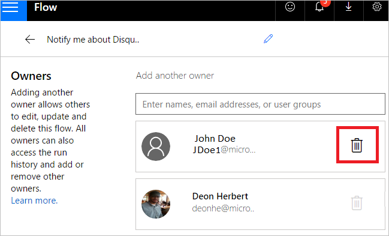
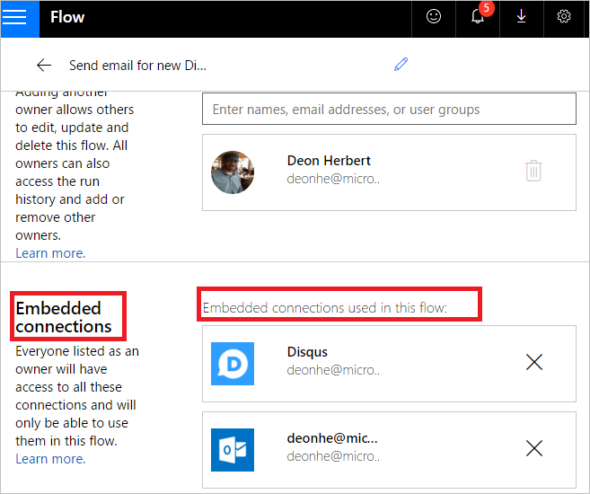

# Crear flujos de equipo
[!INCLUDE [view-pending-approvals](includes/cc-rebrand.md)]
Cree un flujo de equipo agregando otros usuarios de su organización como propietarios. Todos los propietarios de un flujo de equipo pueden realizar estas acciones:

* Vea el historial del flujo (es decir, cada ejecución).
* Administrar las propiedades del flujo (por ejemplo, iniciar o detener el flujo, agregar propietarios o actualizar las credenciales de una conexión).
* Editar la definición del flujo (por ejemplo, agregar o quitar una acción o condición).
* Agregue y quite otros propietarios (pero no el creador del flujo).
* Elimine el flujo.

Si es el creador o propietario de un flujo de equipo, verá que aparece en la pestaña flujos de **equipo** en [Microsoft Flow](https://flow.microsoft.com).

> [!NOTE]
> Las conexiones compartidas **solo** se pueden usar en el flujo en el que se crearon.
> 
> 

Los propietarios pueden usar los servicios de un flujo, pero no pueden modificar las credenciales de una conexión creada por otro propietario.

## Requisitos previos
Debe tener un [plan de Microsoft Flow de pago](https://flow.microsoft.com/pricing/) para crear un flujo de equipo. Además, debe ser el creador o el propietario para agregar o quitar propietarios de un flujo de equipo.

## Crear un flujo de equipo
Siga estos pasos para crear un flujo de equipo o para agregar más propietarios a un flujo de equipo.

1. Inicie sesión en el [Microsoft Flow](https://flow.microsoft.com)y, a continuación, seleccione **Mis flujos**.
2. Seleccione el icono de personas para el flujo que desea modificar:
   
    
3. Escriba el nombre, la dirección de correo electrónico o el nombre de grupo para la persona o el grupo que desea agregar como propietario:
   
    
4. En la lista que aparece, seleccione el usuario que desea convertir en propietario:
   
    
   
     El usuario o grupo que ha seleccionado se convierte en propietario del flujo:
   
    
   
     Enhorabuena &mdash; se ha creado el flujo de equipo.

## Agregar una lista como copropietario

Puede Agregar listas de SharePoint como copropietarios a un flujo para que todos los usuarios que tengan acceso de edición a la lista obtengan automáticamente acceso de edición al flujo. Una vez que se comparte el flujo, puede simplemente distribuir un vínculo a él.

> [!TIP]
> Use una lista cuando el flujo esté conectado a SharePoint y use un grupo en otros casos.
>

## Quitar un propietario

> [!IMPORTANT]
> Al quitar un propietario cuyas credenciales se usan para tener acceso a Microsoft Flow Services, debe actualizar las credenciales de esas conexiones para que el flujo siga ejecutándose correctamente.
> 
> 

1. Seleccione el icono de personas para el flujo que desea modificar:
   
    
2. Seleccione el icono **eliminar** del propietario que desea quitar:
   
    
3. En el cuadro de diálogo de confirmación, seleccione **quitar este propietario**:
   
    
4. Enhorabuena &mdash; el usuario o grupo que quitó ya no aparece como propietario del flujo:
   
    

## Actualizar el propietario de la conexión

Es posible que tenga que cambiar el propietario de una conexión en un flujo si quita el propietario existente. Siga estos pasos para cambiar el propietario de un flujo:

1. Seleccione **datos** en el panel de la izquierda.
1. Seleccione **conexiones**.
1. Busque la conexión que desea actualizar y selecciónela.
1. Seleccione **...** (más comandos) en la conexión que ha seleccionado y, a continuación, seleccione **cambiar de cuenta**.
1. Siga los pasos para usar una cuenta diferente para la conexión.

## Embedded y otras conexiones

Las conexiones usadas en un flujo se dividen en dos categorías:

* **Incrustado** &mdash; estas conexiones se utilizan en el flujo.
* **Otros** &mdash; estas conexiones se han definido para un flujo, pero no se usan en ella.

Si deja de usar una conexión en un flujo, esa conexión aparece en la lista **otras** conexiones, donde permanecerá hasta que un propietario la incluya en el flujo de nuevo.

Siga los pasos para [actualizar el propietario de una conexión](./create-team-flows.md#update-connection-owner) con el fin de realizar cambios en las conexiones incrustadas.

La lista de conexiones aparece en la lista de propietarios de las propiedades de un flujo:

