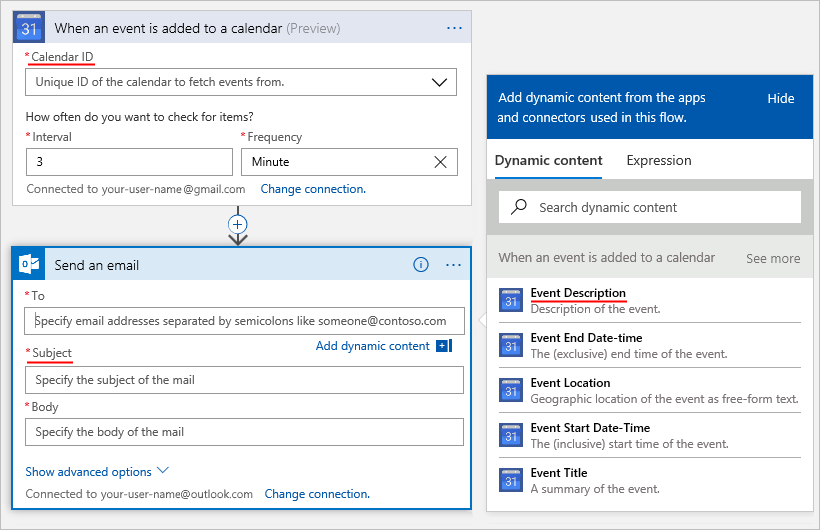
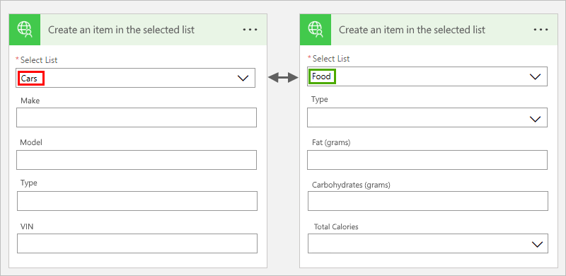
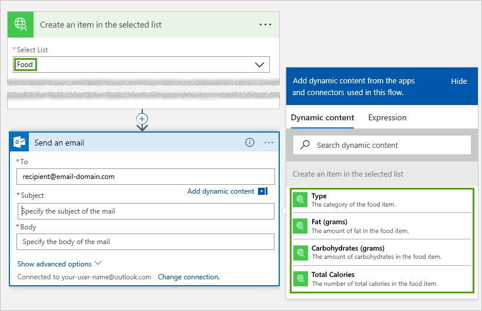

# <a name="openapi-extensions-for-custom-connectors-in-microsoft-flow"></a>Extensiones de OpenAPI para conectores personalizados en Microsoft Flow
## <a name="introduction"></a>Introducción
Para crear conectores personalizados para Microsoft Flow, Azure Logic Apps o Microsoft PowerApps, es preciso proporcionar un archivo de definición de OpenAPI, que es un documento que puede estar escrito en distintos lenguajes, que la máquina puede leer y que describe las operaciones y los parámetros de la API. Junto con la funcionalidad estándar de OpenAPI, también puede incluir estas extensiones OpenAPI al crear conectores personalizados para Logic Apps y Flow:

* `summary`
* `x-ms-summary`
* `description`
* `x-ms-visibility`
* `x-ms-dynamic-values`
* `x-ms-dynamic-schema`

Aquí encontrará más detalles acerca de estas extensiones:

<a name="summary"></a>

## <a name="summary"></a>resumen
Especifica el título de la acción (operación). </br>
Se aplica a: operaciones </br>
Recomendación: usar el *tipo de oración* para `summary`. </br>
Ejemplo: "Cuando se agrega un evento al calendario" o "Enviar un correo electrónico"


``` json
"actions" {
  "Send_an_email": {
    /// Other action properties here...
    "summary": "Send an email",
    /// Other action properties here...
  }
},
```

## <a name="x-ms-summary"></a>x-ms-summary
Especifica el título de una entidad. </br>
Se aplica a: parámetros y esquema de respuesta </br>
Recomendación: usar el *tipo título* para `x-ms-summary`. </br>
Ejemplo: "Id. de calendario", "Asunto", "Descripción del evento", etc.



``` json
"actions" {
  "Send_an_email": {
    /// Other action properties here...
    "parameters": [ 
      {
        /// Other parameters here...
        "x-ms-summary": "Subject",
        /// Other parameters here...
      }
    ]
  }
},
```
<a name="description"></a>

## <a name="description"></a>descripción
Especifica una explicación detallada de la funcionalidad de la operación o el formato y la función de una entidad. </br>
Se aplica a: operaciones, parámetros y esquema de respuesta </br>
Recomendación: usar el *tipo de oración* para `description`. </br>
Ejemplo: "Esta operación se desencadena cuando se agrega un nuevo evento al calendario", "Especificar el asunto del correo electrónico", etc.


``` json
"actions" {
  "Send_an_email": {
     "description": "Specify the subject of the mail",
     /// Other action properties here...
  }
},
```

<a name="visibility"></a>

## <a name="x-ms-visibility"></a>x-ms-visibility
Especifica la visibilidad orientada hacia el usuario de una entidad. </br>
Valores posibles: `important`, `advanced` y `internal` </br>
Se aplica a: operaciones, parámetros y esquemas

* `important` las operaciones y los parámetros siempre se muestran en primer lugar al usuario.
* `advanced` las operaciones y los parámetros están ocultos en un menú adicional.
* `internal` las operaciones y los parámetros se ocultan al usuario.

> [!NOTE]
> En el caso de los parámetros que sean `internal` y `required`, **debe** proporcionar los valores predeterminados de los mismos.
> 
> 

Ejemplo: los menús **Ver más** y **Mostrar opciones avanzadas** no muestran las operaciones y los parámetros `advanced`.


``` json
"actions" {
  "Send_an_email": {
     /// Other action properties here...
     "parameters:": [
         {
           "name": "Subject",
           "type": "string",
           "description": "Specify the subject of the mail",
           "x-ms-summary": "Subject",
           "x-ms-visibility": "important",
           /// Other parameter properties here
         }
     ]
     /// Other action properties here...
  }
},
```

## <a name="x-ms-dynamic-values"></a>x-ms-dynamic-values
Muestra al usuario una lista rellena, con el fin de que se puedan seleccionar los parámetros de entrada de una operación. </br>
Se aplica a: parámetros </br>
Cómo se usa: agregue el objeto `x-ms-dynamic-values` a la definición del parámetro. Por ejemplo, consulte este [ejemplo de OpenAPI](https://procsi.blob.core.windows.net/blog-images/sampleDynamicSwagger.json).


### <a name="properties-for-x-ms-dynamic-values"></a>Propiedades de x-ms-dynamic-values
| Nombre | Requerido u opcional | Descripción |
| --- | --- | --- |
| **operationID** |Necesario |La operación a la que se llamar para rellenar la lista. |
| **value-path** |Necesario |Una cadena de ruta de acceso en el objeto dentro de `value-collection` que hace referencia al valor del parámetro. Si `value-collection` no se especifica, la respuesta se evalúa como una matriz. |
| **value-title** |Opcional |Una cadena de ruta de acceso en el objeto dentro de `value-collection` que hace referencia a una descripción del valor. Si `value-collection` no se especifica, la respuesta se evalúa como una matriz. |
| **value-collection** |Opcional |Una cadena de ruta de acceso que se evalúa como una matriz de objetos en la carga útil de respuesta |
| **parameters** |Opcional |Un objeto cuyas propiedades especifican los parámetros de entrada necesarios para invocar una operación dynamic-values |

Este es un ejemplo que muestra las propiedades de `x-ms-dynamic-values`:

``` json
"x-ms-dynamic-values": {
  "operationId": "PopulateDropdown",
  "value-path": "name",
  "value-title": "properties/displayName",
  "value-collection": "value",
  "parameters": {
     "staticParameter": "{value}",
     "dynamicParameter": {
        "parameter": "{value-to-pass-to-dynamicParameter}"
     }
  }
}
```

## <a name="example-all-the-openapi-extensions-up-to-this-point"></a>Ejemplo: todas las extensiones de OpenAPI hasta este momento
``` json
"/api/lists/{listID-dynamic}": {
    "get": {
        "description": "Get items from a single list - uses dynamic values and outputs dynamic schema",
        "summary": "Gets items from the selected list",
        "operationID": "GetListItems",
        "parameters": [
           {
             "name": "listID-dynamic",
             "type": "string",
             "in": "path",
             "description": "Select the list from where you want outputs",
             "required": true,
             "x-ms-summary": "Select List",
             "x-ms-dynamic-values": {
                "operationID": "GetLists",
                "value-path": "id",
                "value-title": "name"
             }
           }
        ]
    }
}
```

## <a name="x-ms-dynamic-schema"></a>x-ms-dynamic-schema
Indica que el esquema del parámetro o respuesta actuales es dinámico. Este objeto puede invocar una operación a la que define el valor de este campo, detectar dinámicamente el esquema y mostrar la interfaz de usuario apropiada para recopilar los datos que introduce el usuario o mostrar los campos disponibles. 

Se aplica a: parámetros y respuesta

Cómo se usa: agregue el objeto `x-ms-dynamic-schema` a la definición del cuerpo de la respuesta o parámetro de una solicitud. Vea este [ejemplo de OpenAPI](https://procsi.blob.core.windows.net/blog-images/sampleDynamicSwagger.json).

Este ejemplo muestra cómo cambia el formulario de entrada en función del elemento que el usuario selecciona en la lista desplegable:



Y este ejemplo muestra cómo cambia el resultado en función del elemento que el usuario selecciona en la lista desplegable: En esta versión, el usuario selecciona "Cars":


En esta versión, el usuario selecciona "Food":



### <a name="properties-for-x-ms-dynamic-schema"></a>Propiedades de x-ms-dynamic-schema
| Nombre | Requerido u opcional | Descripción |
| --- | --- | --- |
| **operationID** |Necesario |La operación a la que se llama para capturar el esquema. |
| **parameters** |Necesario |Un objeto cuyas propiedades especifican los parámetros de entrada necesarios para invocar una operación dynamic-schema |
| **value-path** |Opcional |Una cadena de ruta de acceso que hace referencia a la propiedad que tiene el esquema. </br>Si no se especifica, se supone que la respuesta contiene el esquema en las propiedades del objeto raíz. |
|  | | |

Este es un ejemplo de un parámetro dinámico:

``` json
{
  "name": "dynamicListSchema",
  "in": "body",
  "description": "Dynamic schema for items in the selected list",
  "schema": {
    "type": "object",
    "x-ms-dynamic-schema": {
        "operationID": "GetListSchema",
        "parameters": {
          "listID": {
            "parameter": "listID-dynamic"
          }
        },
        "value-path": "items"
    }
  }
}
```

Este es un ejemplo de una respuesta dinámica:

``` json
"DynamicResponseGetListSchema": {
   "type": "object",
   "x-ms-dynamic-schema": {
      "operationID": "GetListSchema",
      "parameters": {
         "listID": {
            "parameter": "listID-dynamic"
         }
      },
      "value-path": "items"
    }
}
```

## <a name="next-steps"></a>Pasos siguientes
[Registro de un conector personalizado](register-custom-api.md).

[Use una ASP.NET Web API](customapi-web-api-tutorial.md).

[Registro de una API de Azure Resource Manager](customapi-azure-resource-manager-tutorial.md).

