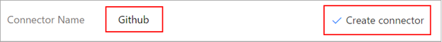

# <a name="use-webhooks-with-microsoft-flow"></a>Uso de webhooks con Microsoft Flow
[Webhooks](http://www.webhooks.org/) son devoluciones de llamada HTTP simples que se utilizan para proporcionar notificaciones de eventos.  Microsoft Flow permite usar webhooks para desencadenar flujos.  En este tutorial se muestra cómo crear un flujo desencadenado por un webhook.

> [!NOTE]
> Usaremos GitHub como un ejemplo de un servicio que puede enviar notificaciones a través de webhooks, pero las técnicas que se muestran a continuación se pueden extender a cualquier servicio que use webhook.
> 
> 

## <a name="prerequisites"></a>Requisitos previos
Para completar el tutorial, necesitará:

* Conocimientos básicos de [webhooks](http://www.webhooks.org/).
* Conocimientos básicos de la [especificación OpenAPI](http://swagger.io/specification/) (Swagger).
* Una cuenta de [GitHub](https://www.github.com).
* El [archivo JSON de OpenAPI de ejemplo](http://pwrappssamples.blob.core.windows.net/samples/githubWebhookSample.json) utilizado en este tutorial.
* Como alternativa también puede utilizar la [interfaz de usuario de los desencadenadores](customapi-webhooks.md#creating-webhook-triggers-from-the-ui) para definir desencadenadores de webhook, en caso de que no desee escribir manualmente el archivo OpenAPI.

## <a name="the-openapi-file"></a>Archivo OpenAPI
Los webhooks se implementan en Microsoft Flow como un tipo de [conector personalizado](register-custom-api.md), por lo que será necesario proporcionar un archivo JSON de OpenAPI para definir la forma de nuestro webhook.  El archivo OpenAPI contiene tres definiciones fundamentales para realizar el trabajo de webhook:

1. Creación de webhook
2. Definición de la solicitud de enlace entrante desde la API (en este caso, GitHub)
3. Eliminación de webhook

### <a name="creating-the-webhook"></a>Creación de webhook
Una solicitud HTTP POST a `/repos/{owner}/{repo}/hooks` crea el webhook en el lado de GitHub.  Microsoft Flow tendrá que publicar en esta dirección URL cuando se cree un flujo con el desencadenador definido en el archivo OpenAPI, o cada vez que se modifique el desencadenador.  En el ejemplo siguiente, la propiedad `post` contiene el esquema de la solicitud que se publicará en GitHub.

```json
"/repos/{owner}/{repo}/hooks": {
    "x-ms-notification-content": {
    "description": "Details for Webhook",
    "schema": {
        "$ref": "#/definitions/WebhookPushResponse"
    }
    },
    "post": {
    "description": "Creates a Github webhook",
    "summary": "Triggers when a PUSH event occurs",
    "operationId": "webhook-trigger",
    "x-ms-trigger": "single",
    "parameters": [
        {
        "name": "owner",
        "in": "path",
        "description": "Name of the owner of targetted repository",
        "required": true,
        "type": "string"
        },
        {
        "name": "repo",
        "in": "path",
        "description": "Name of the repository",
        "required": true,
        "type": "string"
        },
        {
        "name": "Request body of webhook",
        "in": "body",
        "description": "This is the request body of the Webhook",
        "schema": {
            "$ref": "#/definitions/WebhookRequestBody"
        }
        }
    ],
    "responses": {
        "201": {
        "description": "Created",
        "schema": {
            "$ref": "#/definitions/WebhookCreationResponse"
        }
        }
    }
    }
},
```

> [!IMPORTANT]
> La propiedad `"x-ms-trigger": "single"` es una extensión de esquema que indica a Microsoft Flow que muestre este webhook en la lista de los desencadenadores disponibles en el diseñador de flujos; por tanto, asegúrese de incluirlo.
> 
> 

### <a name="defining-the-incoming-hook-request-from-the-api"></a>Definición de la solicitud de enlace entrante a través de la API
La forma de la solicitud de enlace entrante (la notificación de GitHub a Microsoft Flow) se define en la propiedad `x-ms-notification-content` personalizada, como se muestra en el ejemplo anterior.  No necesita incluir todo el contenido de la solicitud, solo las partes que desee usar en los flujos.

### <a name="deleting-the-webhook"></a>Eliminación de webhook
Es muy importante incluir una definición en el archivo OpenAPI que indique a Microsoft Flow cómo eliminar el webhook.  Microsoft Flow intentará eliminar el webhook cada vez que actualice el desencadenador en el flujo, o bien cuando se elimine el flujo.

```json
"/repos/{owner}/{repo}/hooks/{hook_Id}": {
    "delete": {
    "description": "Deletes a Github webhook",
    "operationId": "DeleteTrigger",
    "parameters": [
        {
        "name": "owner",
        "in": "path",
        "description": "Name of the owner of targetted repository",
        "required": true,
        "type": "string"
        },
        {
        "name": "repo",
        "in": "path",
        "description": "Name of the repository",
        "required": true,
        "type": "string"
        },
        {
        "name": "hook_Id",
        "in": "path",
        "description": "ID of the Hook being deleted",
        "required": true,
        "type": "string"
        }
    ]
    }
},
```

> [!IMPORTANT]
> Para que Microsoft Flow pueda eliminar un webhook, la API **debe** incluir un encabezado HTTP `Location` en la respuesta 201 cuando se crea el webhook.  El encabezado `Location` debe contener la ruta de acceso al webhook que se usará con HTTP DELETE.  Por ejemplo, el valor de `Location` incluido con la respuesta de GitHub tendrá este formato: `https://api.github.com/repos/<user name>/<repo name>/hooks/<hook ID>`.
> 
> 

## <a name="authentication"></a>Autenticación
Normalmente, la API que envía la solicitud de webhook a Microsoft Flow tendrá algún tipo de autenticación y GitHub no es ninguna excepción.  Se admiten varios tipos de autenticación.  Para este tutorial, usaremos tokens de acceso personal de GitHub.

1. Vaya a [GitHub](https://www.github.com) e inicie sesión si aún no lo ha hecho.
2. En la esquina superior derecha, haga clic en la **imagen de su perfil** y, en el menú, haga clic en **Configuración**.
   
    
3. En el menú de la izquierda, bajo **Configuración de desarrollador**, haga clic en **Tokens de acceso personal**.
   
    
4. Haga clic en el botón **Generar token**.
   
    
5. En el cuadro **Token description** (Descripción del token), escriba una descripción.
6. Active la casilla **admin:repo_hook**.
   
    
7. Haga clic en el botón **Generar token**.
8. Tome nota de su nuevo token.
   
    
   
   > [!IMPORTANT]
   > No podrá volver a acceder a este token. Debe copiarlo y pegarlo en el Bloc de notas o similar para usarlo más adelante en el tutorial.
   > 
   > 

## <a name="adding-the-webhook-to-microsoft-flow"></a>Incorporación del webhook a Microsoft Flow
Ahora tenemos todo lo que necesitamos para agregar el webhook a Microsoft Flow como un conector personalizado.

1. Vaya al [portal web de Microsoft Flow](https://flow.microsoft.com) e inicie sesión si aún no lo ha hecho.
2. Haga clic en el icono de **configuración** y, a continuación, en **Conectores personalizados**.
   
    
3. Haga clic en el botón **Crear conector personalizado**.
4. Haga clic en el icono de carpeta de archivos en el cuadro **Importar de OpenAPI** y seleccione el archivo OpenAPI de ejemplo.
5. Haga clic en **Cargar icono**, en la sección **Información general** y seleccione un archivo de imagen para utilizarlo como un icono.
6. Haga clic en **Continuar**.
   
    
7. En la pantalla siguiente, estableceremos la configuración de seguridad.  En **Tipo de autenticación**, seleccione **Autenticación básica**.
8. En la sección **Autenticación básica**, para los campos de etiqueta, escriba el **nombre de usuario** y la **contraseña**.  Tenga en cuenta que son únicamente etiquetas que se mostrarán cuando se use el desencadenador en un flujo.
   
    
9. En la parte superior de la página, asigne un nombre a flujo y haga clic en **Crear conector**.
   
    

El nuevo conector personalizado debería aparecer ahora en la lista en la página de conectores personalizados.

## <a name="creating-webhook-triggers-from-the-ui"></a>Creación de desencadenadores de webhook desde la interfaz de usuario
1. Después de cargar o crear el archivo OpenAPI de línea de base, navegue hasta la pestaña **Definición** del asistente del conector personalizado.
2. En el panel izquierdo, haga clic en **Nuevo desencadenador** y rellene la descripción de su desencadenador. En este ejemplo, vamos a crear un desencadenador que se activa cuando se realiza una solicitud de extracción en un repositorio.
   
    
3. A continuación, defina la solicitud para crear el desencadenador de webhook. Puede hacerlo con la importación de una solicitud de *creación de desencadenador de webhook* de ejemplo. Consulte la [referencia de la API de Github](https://developer.github.com/v3/repos/hooks/#create-a-hook) para crear un webhook. 
4. Microsoft Flow agrega automáticamente el estándar ```content-type``` y los encabezados de seguridad, por lo que no es necesario definirlos durante la importación de un ejemplo. 
   
    
5. Después de importar la solicitud de creación de webhook, se definirá la respuesta de este mediante la importación de una respuesta de ejemplo. Consulte la [referencia de la API de Github](https://developer.github.com/v3/activity/events/types/#pullrequestevent) para obtener una solicitud de extracción. 
   
    **Nota**: no tendrá que pegar la respuesta completa. Solo se deben definir los campos que necesite.
   En este ejemplo, solo se extrae la dirección URL de la solicitud de extracción y la información del usuario que la efectuó.
   
    
6. El paso final consiste en seleccionar un parámetro en la solicitud de creación de webhook cuyo valor debe rellenar Microsoft Flow con una dirección URL de devolución de llamada para que Github la rellene. Esta es la propiedad de dirección URL del objeto ```config```.
   
    

## <a name="using-the-webhook-as-a-trigger"></a>Uso del webhook como un desencadenador
Ahora que tenemos todo configurado, podemos utilizar el webhook en un flujo.  Vamos a crear un flujo que enviará una notificación push a la aplicación móvil de Microsoft Flow cada vez que nuestro repositorio de GitHub reciba una inserción de git.

1. En el [portal web de Microsoft Flow](https://flow.microsoft.com), en la parte superior de la página, haga clic en **My flows** (Mis flujos).
2. Haga clic en **Crear desde cero**.
3. En el diseñador de Microsoft Flow, busque el conector personalizado que hemos registrado anteriormente.
   
    
   
    Haga clic en el elemento de la lista para usarlo como un desencadenador.
4. Puesto que es la primera vez que hemos usado este conector personalizado, tenemos que conectarnos a él.  En **Nombre de conexión**, escriba un nombre descriptivo.  En **Nombre de usuario**, use el nombre de usuario de GitHub.  En **Contraseña**, use el **token de acceso personal** que creó anteriormente.
   
    
   
    Haga clic en **Crear**.
5. Ahora necesitamos proporcionar a Microsoft Flow información sobre el repositorio que desea supervisar.  Es posible que reconozca los campos del objeto **WebhookRequestBody** en el archivo OpenAPI.  Como **propietario** y **repositorio**, escriba el nombre de propietario y de un repositorio de GitHub que desea supervisar.
   
    
   
   > [!IMPORTANT]
   > En este ejemplo, utilizo el repositorio para [Visual Studio Code](https://code.visualstudio.com). Debe usar un repositorio para el que su cuenta tenga derechos.  La manera más fácil de hacerlo sería utilizar su propio repositorio.
   > 
   > 
6. Haga clic en **+ Nuevo paso** y haga clic en **Agregar una acción**.
7. Busque y seleccione la acción **Notificación push**.
   
    
8. Escriba algún texto en el campo **Texto**.  Tenga en cuenta que el objeto **WebhookPushResponse** en el archivo OpenAPI define la lista de parámetros que puede usar.
   
    
9. En la parte superior de la página, asigne un nombre al flujo y haga clic en **Create flow** (Crear flujo).
   
    

## <a name="verification-and-troubleshooting"></a>Comprobación y solución de problemas
Para comprobar que todo está configurado correctamente, haga clic en **Mis flujos** (Mis flujos) y en el **icono de información**, situado al lado del nuevo flujo, para ver el historial de ejecución.  Ya debería ver al menos una ejecución correcta desde la creación del webhook.  Esto indica que el webhook se creó correctamente en el lado de GitHub.  Si se produce un error en la ejecución, puede consultar los detalles de ejecución para ver por qué se produjo el error.  Si el error se debió a una respuesta "404 no encontrado", es probable que su cuenta de GitHub no tenga los permisos correctos para crear un webhook en el repositorio que ha utilizado.

## <a name="summary"></a>Resumen
Si todo está configurado correctamente, ahora recibirá notificaciones de inserción en la aplicación móvil Microsoft Flow siempre que se produzca una inserción de git en el repositorio de GitHub que seleccionó.  Mediante el proceso anterior puede usar cualquier servicio compatible con webhook como un desencadenador en los flujos.

## <a name="next-steps"></a>Pasos siguientes
* [Registro de un conector personalizado](register-custom-api.md).
* [Use una ASP.NET Web API](customapi-web-api-tutorial.md).
* [Registro de una API de Azure Resource Manager](customapi-azure-resource-manager-tutorial.md).

