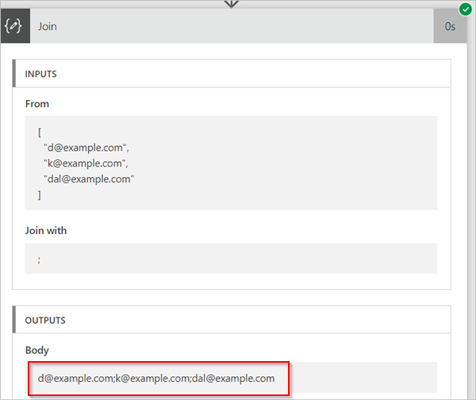

# <a name="use-data-operations-with-microsoft-flow"></a>Usar operaciones de datos con Microsoft Flow
[!INCLUDE [view-pending-approvals](includes/cc-rebrand.md)]
En este tutorial, obtendrá información sobre algunas de las operaciones de datos más populares del Microsoft Flow, como componer, combinar, seleccionar, filtrar matriz, crear tabla y analizar JSON que están disponibles para manipular los datos al crear flujos.

## <a name="prerequisites"></a>Requisitos previos
* Acceso a Microsoft Flow.
* Una herramienta como [Postman](https://www.getpostman.com/postman) para enviar solicitudes HTTP POST con una matriz JSON al flujo.

## <a name="use-the-compose-action"></a>Usar la acción de redacción
Use la acción **operaciones de datos-redactar** (Compose) para evitar escribir datos idénticos varias veces al diseñar un flujo. Por ejemplo, si necesita especificar una matriz de dígitos: ````[0,1,2,3,4,5,6,7,8,9]```` varias veces mientras diseña el flujo, puede usar la acción de redacción para guardar la matriz de la siguiente manera:

1. Busque **redactar**y, a continuación, seleccione la acción **operaciones de datos-redactar** (Compose).
   
    
2. Escriba la matriz en el cuadro **entradas** a la que desea hacer referencia más adelante:
   
    

> [!TIP]
> Para facilitar la referencia más adelante, cambie el nombre de la tarjeta de **redacción** haciendo clic en el texto "redactar" en la barra de título de la tarjeta de **redacción** .
> 
> 

Cuando necesite acceder al contenido de la acción de redacción, hágalo a través del token de **salida** en la lista **agregar contenido dinámico de las aplicaciones y conectores que se usan en este flujo** siguiendo estos pasos:

1. Agregue una acción como **operaciones de datos – join**.
2. Seleccione el control al que desea agregar el contenido que guardó en la acción redactar.
   
    Se abre **agregar contenido dinámico de las aplicaciones y conectores que se usan en este flujo** .
3. En **agregar contenido dinámico de las aplicaciones y conectores que se usan en este flujo**, seleccione el token de **salida** que se encuentra debajo de la categoría **redactar** de la pestaña **contenido dinámico** .
   
    

## <a name="use-the-join-action"></a>Usar la acción de combinación
Use la acción **operaciones de datos-join** (Join) para delimitar una matriz con un separador de su elección. Por ejemplo, suponga que el flujo recibe una solicitud Web que incluye la siguiente matriz de direcciones de correo electrónico: ````["d@example.com", "k@example.com", "dal@example.com"]````. Sin embargo, el programa de correo electrónico requiere que las direcciones sean una sola cadena separada por signos de punto y coma. Para ello, use la acción **operaciones de datos-unirse** (Join) para cambiar el delimitador de coma por un punto y coma ";" siguiendo estos pasos:

1. Agregue una nueva acción, busque **combinación**y, a continuación, seleccione **operaciones de datos-unirse** (Join).
   
    
2. Escriba la matriz en el cuadro **desde** y, a continuación, escriba el nuevo delimitador que desee usar en el cuadro **combinar con** .
   
    Aquí, he usado el punto y coma (;) como el nuevo delimitador.
   
    
3. Guarde el flujo y ejecútelo.
4. Una vez que se ejecuta el flujo, la salida de la acción **Data Operations-join** será:
   
    

## <a name="use-the-select-action"></a>Usar la acción seleccionar
Use las **operaciones de datos – Select** (Select) para transformar la forma de los objetos en una matriz. Por ejemplo, puede Agregar, quitar o cambiar el nombre de los elementos de cada objeto de una matriz.

> [!NOTE]
> Aunque puede Agregar o quitar elementos mediante la acción Select, no puede cambiar el número de objetos de la matriz.
> 
> 

Por ejemplo, puede usar la acción seleccionar si los datos entran en el flujo a través de una solicitud Web en este formato:

````[ { "first": "Deon", "last": "Herb" }, { "first": "K", "last": "Herb" } ]````

y desea cambiar la forma de los datos entrantes cambiando el nombre "primero" por "FirstName", "Last" por "LastName" y agregando un nuevo miembro denominado "FamilyName" que combina "First" y "Last" (separado por un espacio):

````[ { "FirstName": "Deon", "FamilyName": "Herb", "FullName": "Deon Herb" }, { "FirstName": "K", "FamilyName": "Herb", "FullName": "K Herb" } ]````.

Para ello:

1. Agregue la acción **solicitud/respuesta – respuesta** (solicitud) al flujo.
2. Seleccione el **uso de la carga de ejemplo para generar el esquema** desde la tarjeta de **solicitud** .
3. En el cuadro que se muestra, pegue un ejemplo de la matriz de datos de origen y, a continuación, seleccione el botón **listo** .
4. Agregue la acción **operaciones de datos – seleccionar** (seleccionar) y, a continuación, configúrela como la siguiente imagen.
   
    
   
   > [!TIP]
   > La salida de la acción Select es una matriz que contiene los objetos que se han aplicado recientemente. Después, puede usar esta matriz en cualquier otra acción, como **Compose**, que se explicó anteriormente.
   > 
   > 

## <a name="use-the-filter-array-action"></a>Usar la acción filtrar matriz
Usar **operaciones de datos: filtrar matriz** (matriz de filtros) para reducir el número de objetos de una matriz a un subconjunto que coincide con los criterios proporcionados.

> [!NOTE]
> La matriz de filtro no se puede usar para cambiar la forma de los objetos en una matriz. Además, el texto en el que se filtra distingue mayúsculas de minúsculas.
> 
> 

Por ejemplo, puede usar Filter array en esta matriz:

````[ { "first": "Deon", "last": "Herb" }, { "first": "K", "last": "Herb" } ]````

para crear una nueva matriz que contenga solo los objetos en los que *First* se establece en "Deon".

Vamos a hacer esto.

1. Busque y, a continuación, agregue la acción **operaciones de datos-filtrar matriz** (matriz de filtro) al flujo.
2. Configure la acción filtrar matriz como la siguiente imagen.
   
    
3. Guarde y, a continuación, ejecute el flujo.
   
    Puede usar [Postman](https://www.getpostman.com/postman) para generar una solicitud Web que envíe una matriz JSON al flujo.
4. Cuando se ejecuta el flujo, suponiendo que la entrada JSON tiene el siguiente aspecto:
   
    ````[ { "first": "Deon", "last": "Herb" }, { "first": "K", "last": "Herb" } ]````,
   
    el resultado es similar a esta matriz (Observe que solo los objetos en los que *First* se establece en "Deon" se incluyen en la salida de la acción):
   
    ````[ { "first": "Deon", "last": "Herb" } ]````

## <a name="use-the-create-csv-table-action"></a>Uso de la acción crear tabla CSV
Use las **operaciones de datos-crear tabla CSV** (crear tabla CSV) para cambiar una entrada de la matriz JSON en una tabla de valores separados por comas (CSV). Opcionalmente, puede mantener los encabezados visibles en la salida CSV. Por ejemplo, puede convertir la siguiente matriz en una tabla CSV mediante el uso de la acción **crear tabla CSV** :

````[ { "first": "Deon", "last": "Herb" }, { "first": "K", "last": "Herb" } ]````

1. Busque, agregue y configure la acción **operaciones de datos-crear tabla CSV** para que se parezca a la siguiente imagen.
   
    
   
    Nota: el token de **cuerpo** de esta imagen procede de una acción **solicitud/respuesta – respuesta** ; sin embargo, puede obtener la entrada para la acción **crear tabla CSV** en la salida de cualquier acción anterior del flujo, o puede escribirla directamente en el Cuadro **de** .
2. Guarde y, a continuación, ejecute el flujo.
   
    Cuando se ejecuta el flujo, la salida de la **tabla de creación de CSV** es similar a la de esta imagen:
   
    

## <a name="use-the-create-html-table-action"></a>Uso de la acción crear tabla HTML
Usar **operaciones de datos: cree una tabla HTML** para cambiar una entrada de matriz JSON a una tabla HTML. Opcionalmente, puede mantener los encabezados visibles en la salida HTML.

Para ello, siga los pasos de la [sección creación de una tabla CSV](#use-the-create-csv-table-action) para obtener un ejemplo detallado. Asegúrese de usar la acción **operaciones de datos-crear tabla HTML** , en lugar de la acción **operaciones de datos-crear tabla CSV** .

> [!TIP]
> Si tiene previsto enviar la tabla HTML por correo electrónico, no olvide seleccionar "IsHtml" en la acción de correo electrónico.
> 
> 

