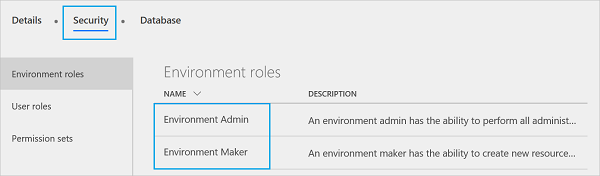
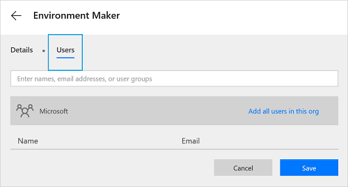

# Uso de entornos dentro de Microsoft Flow
[!INCLUDE [view-pending-approvals](includes/cc-rebrand.md)]

## Privilegios

Los entornos ofrecen las siguientes ventajas:

* **Localidad**de los datos: los entornos se pueden crear en distintas regiones y están enlazados a esa ubicación geográfica. Cuando se crea un flujo en un entorno, dicho flujo se enruta a todos los centros de recursos de esa ubicación geográfica. Esto también proporciona una ventaja de rendimiento.

    Si los usuarios están en Europa, cree y use el entorno en la región de Europa. Si los usuarios están en el Estados Unidos, cree y use el entorno en el 

    > [!IMPORTANT]
    > Si elimina el entorno, también se eliminarán todos los flujos dentro de ese entorno. Esto se aplica a cualquier elemento que cree en ese entorno, incluidas las conexiones, las puertas de enlace, PowerApps, etc.
* **Prevención de pérdida de datos**: como administrador, no desea que los flujos obtengan datos de una ubicación interna (como *OneDrive para la empresa* o una lista de SharePoint que contenga información salarial) y, a continuación, publiquen los datos públicamente (por ejemplo *, Twitter*). Use la prevención de pérdida de datos para controlar qué servicios pueden compartir datos dentro de la implementación de Microsoft Flow.

    Por ejemplo, puede Agregar los servicios *SharePoint* y *OneDrive para la empresa* a una directiva solo de datos empresariales. Los flujos creados en este entorno pueden usar los servicios de *SharePoint* y *OneDrive para la empresa* . Sin embargo, no podrán compartir datos con otros servicios que no estén incluidos en la Directiva de solo datos empresariales.

  > [!NOTE]
  > La prevención de pérdida de datos está disponible con algunas SKU de licencia, incluida la licencia P2.

* **Límite de aislamiento para todos los recursos**: todos los flujos, puertas de enlace, conexiones, conectores personalizados, etc. residen en un entorno específico. No existen en ningún otro entorno.
* **Common Data Service**: estas son las opciones si desea crear un flujo que inserte datos en un servicio:

  * Inserte datos en un archivo de Excel y almacene el archivo de Excel en una cuenta de almacenamiento en la nube, como OneDrive.
  * Cree una SQL Database y, a continuación, almacene los datos en ella.
  * Use el Common Data Service para almacenar los datos.

    Cada entorno puede tener un máximo de una base de datos para los flujos en el Common Data Service. El acceso al Common Data Service depende de la licencia que haya adquirido; el Common Data Service no se incluye con la licencia gratuita.

## Límite

Aunque los entornos proporcionan muchas ventajas, también introducen nuevas limitaciones. El hecho de que los entornos sean un límite de aislamiento significa que nunca se pueden tener recursos que hagan referencia *a recursos entre* entornos. Por ejemplo, no puede crear un conector personalizado en un entorno y, a continuación, crear un flujo que use ese conector personalizado en un entorno diferente.

## Usar el entorno predeterminado

Todos los usuarios comparten el entorno **predeterminado** y cualquier usuario puede crear flujos en el entorno **predeterminado** .

> [!TIP]
> Si es un usuario de vista previa, todos los flujos existentes se encuentran en el entorno predeterminado. Un *usuario de versión preliminar* es alguien que estaba usando Microsoft Flow antes de su lanzamiento a disponibilidad general (GA).

## Centro de administración

Los administradores usan el centro de administración para crear y administrar entornos. Estas son las dos formas de abrir el centro de administración:

### Opción 1: seleccionar configuración

1. Inicie sesión en [Flow.Microsoft.com](https://flow.microsoft.com).
1. Seleccione el engranaje de configuración y elija **centro de administración** en la lista:

   
1. Se abre el centro de administradores.

### Opción 2: abrir admin.flow.microsoft.com

Vaya a [admin.Flow.Microsoft.com](https://admin.flow.microsoft.com)e inicie sesión con su cuenta profesional.

## Crear un entorno

1. En el [centro de administración de Microsoft Flow](https://admin.flow.microsoft.com), seleccione **entornos**. Verá todos los entornos existentes: 
2. Seleccione **nuevo entorno** y proporcione la información necesaria:

   |     Propiedad     |                                                 Denominación                                                 |
   |------------------|-------------------------------------------------------------------------------------------------------------|
   | Nombre del entorno |              Escriba el nombre de su entorno, como `Human Resources`o `Europe flows`.              |
   |      Region      | Elija la ubicación para hospedar su entorno. Para obtener el mejor rendimiento, utilice una región más cercana a los usuarios. |
   | Tipo de entorno |                  Elija un tipo de entorno basado en su licencia: producción o prueba.                   |

     
3. Haga clic en **crear entorno**.
4. Ahora tiene una opción para **crear una base de datos** u **omitir**.
5. Si decide crear la **base de datos**, se le solicitará una **moneda** y un **idioma** para la base de datos. Además, también puede elegir que se implementen aplicaciones y datos de ejemplo.

   

Ahora puede Agregar usuarios al entorno de.

## Administrar los entornos existentes

1. En el [centro de administración de Microsoft Flow](https://admin.flow.microsoft.com), seleccione **entornos**:

   
1. Seleccione un entorno para abrir sus propiedades.
1. Use la pestaña **detalles** para ver información adicional sobre un entorno, incluido quién creó el entorno, su ubicación geográfica, etc.:

   
1. Seleccione **seguridad**.

    Si no seleccionó **crear base de datos** en los pasos anteriores, en **roles de entorno**, hay dos opciones: administración de **entorno** y **creador de entorno**:

    

    Un **creador** puede crear nuevos recursos como flujos, conexiones de datos y puertas de enlace en un entorno.

   > [!NOTE]
   > No es necesario que un usuario sea **creador** para *Editar* los recursos de un entorno. Cada creador determina quién puede editar sus recursos mediante la concesión de permisos a los usuarios que no son creadores del entorno.
   > 
   > 

    Un **Administrador** puede crear directivas de prevención de pérdida de datos y realizar otras tareas administrativas, como crear entornos, agregar usuarios a entornos y asignar privilegios de administrador o creador.

   1. Seleccione el rol **creador de entorno** y, a continuación, seleccione **usuarios**: rol 
   1. Escriba un nombre, una dirección de correo electrónico o un grupo de usuarios al que desee asignar el rol de **creador** .
   1. Seleccione **Guardar**.

1. En **seguridad**, seleccione **roles de usuario**:

    

    Se enumeran los roles existentes, incluidas las opciones para editar o eliminar el rol.

    Seleccione **nuevo rol** para crear un nuevo rol.
1. En **seguridad**, seleccione **conjuntos de permisos**:

    

    Verá todos los conjuntos de permisos y opciones existentes para editar o eliminar roles.

    Seleccione **nuevo conjunto de permisos** para crear un nuevo conjunto de permisos.
1. Si eligió **crear la base**de datos, para almacenar los datos, esta base de datos forma parte de la Common Data Service. Al hacer clic en la pestaña **seguridad** , se le pedirá que navegue hasta el **centro de administración de instancias de Dynamics 365** , donde se puede aplicar la seguridad basada en roles.

1. Seleccione el usuario de la lista de usuarios en el entorno o la instancia.
  

1. Asigne el rol al usuario.

   

> [!NOTE]
> A los usuarios o grupos asignados a estos roles de entorno no se les concede automáticamente acceso a la base de datos del entorno (si existe) y el propietario de la base de datos debe conceder acceso por separado. 
>
>

### Seguridad de base de datos
La capacidad de crear y modificar un esquema de base de datos y conectarse a los datos almacenados en una base de datos aprovisionada en su entorno se controla mediante los roles de usuario y los conjuntos de permisos de la base de datos. Puede administrar los roles de usuario y los conjuntos de permisos de la base de datos de su entorno en la sección **roles de usuario** y **conjuntos de permisos** de la pestaña **seguridad** . 

   

## Preguntas más frecuentes

### ¿Puedo trasladar un flujo entre entornos?

Sí, los flujos se pueden exportar desde un entorno e importarse en otro entorno.

### ¿Qué licencia incluye el Common Data Service?

Solo Microsoft PowerApps plan 2 incluye derechos para crear bases de datos con el Common Data Service. Sin embargo, todos los planes de pago (Microsoft Flow planes 1 y 2 y Microsoft PowerApps planes 1 y 2) tienen los derechos para usar el Common Data Service.

Elija un plan adecuado para usted visitando la página de [precios de Microsoft Flow](https://flow.microsoft.com/pricing/) .

Consulte el documento [preguntas de facturación](billing-questions.md) para obtener respuestas a las preguntas más frecuentes sobre la facturación.

### ¿Se puede usar el Common Data Service fuera de un entorno?

No. El Common Data Service requiere un entorno. [Obtenga más](common-data-model-intro.md) información al respecto.

### ¿Qué regiones incluyen Microsoft Flow?

Microsoft Flow admite la mayoría de las regiones que admite Office 365, consulte [la información general de las regiones](regions-overview.md) para obtener más detalles.

### ¿Qué se necesita para crear mi propio entorno personalizado?

Todos los usuarios con la licencia del plan 2 de Microsoft Flow pueden crear sus propios entornos. Todos los usuarios Microsoft Flow pueden usar entornos creados por los administradores del plan 2, pero no pueden crear sus propios entornos.
