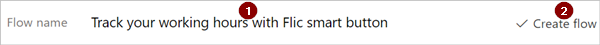
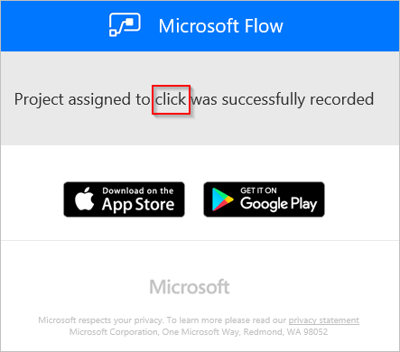

# Ejecute los flujos presionando un botón inteligente de FLIC (versión preliminar)
[!INCLUDE [view-pending-approvals](includes/cc-rebrand.md)]
Desencadene los flujos presionando un botón físico, conocido como Flic, desde los laboratorios de acceso directo. Por ejemplo, presione una FLIC para realizar un seguimiento de las horas de trabajo, bloquear el calendario, contar los visitantes de un evento o guardar las ubicaciones geográficas.

> [!IMPORTANT]
> Configure todas las propiedades de FLIC mediante la aplicación móvil de FLIC para [Android](https://play.google.com/store/apps/details?id=io.flic.app) o [iOS](https://itunes.apple.com/us/app/flic-app/id977593793?ls=1&mt=8) antes de crear el flujo.
> 
> 

## Requisitos previos
Para usar Flics con Microsoft Flow, debe tener:

* Acceso a [Microsoft Flow](https://flow.microsoft.com).
* Se descargó la aplicación móvil [Android](https://play.google.com/store/apps/details?id=io.flic.app) o [iOS](https://itunes.apple.com/us/app/flic-app/id977593793?ls=1&mt=8) de FLIC y se usó para emparejar una o más Flics.

## Configuración de las propiedades de FLIC
Use la aplicación móvil de FLIC para programar los eventos de FLIC. Los eventos son:

* hacer clic (una rápida)
* doble clic (dos pulsaciones rápidas)
* Hold (una prensa larga)

En esta captura de pantalla se muestra un ejemplo de cómo podría ser el proceso de configuración de Flic:

Después de vincular un evento Flic a Microsoft Flow, puede seleccionar ese Flic como un desencadenador para los flujos. Los desencadenadores se seleccionan más adelante en este tutorial.

## Creación de un flujo desencadenado por un Flic
En este tutorial, usamos un FLIC para ejecutar un flujo que registra el tiempo que un consultor invierte en cada cliente. El consultor presiona el FLIC una vez cuando llega y, a continuación, lo vuelve a presionar justo antes de salir del cliente. Cada vez que se presiona el FLIC, se inicia una ejecución del flujo al que está conectado. El flujo guarda la hora actual en hojas de Google y, después, envía una notificación por correo electrónico. El correo electrónico contiene detalles sobre la ejecución del flujo.

Nota: Asegúrese de que ha usado la aplicación móvil FLIC para emparejar y configurar al menos una acción de **clic** para desencadenar Microsoft Flow. En esta captura de pantalla, he configurado la acción de **clic** para desencadenar Microsoft Flow. Más adelante en este tutorial, configuraremos el flujo para que se desencadene cuando el FLIC se presione una vez (se haga clic en él).

   

Vamos a empezar a crear el flujo.

### Comenzar con una plantilla
1. Inicie sesión en [Microsoft Flow](https://flow.microsoft.com).
   
    
2. Escriba **Flic** en el cuadro de búsqueda y, a continuación, seleccione el icono de búsqueda.
   
    
3. Seleccione la plantilla **realizar un seguimiento de las horas de trabajo con el botón inteligente Flic** .
   
    

### Crear una hoja de cálculo en hojas de cálculo de Google
1. Revise los detalles de la plantilla y tenga en cuenta que esta plantilla requiere una hoja de cálculo en hojas de cálculo de Google.
   
   
2. En hojas de cálculo de Google, cree una hoja de cálculo que contenga una hoja con columnas denominadas **ClickType** y **timestamp**.
   
      Sugerencia: para asignar un nombre a las columnas de Google Sheets, escriba el nombre de la columna en la parte superior de la columna. Por lo tanto, la hoja debe aparecer como en esta captura de pantalla:
   
   
   
   Nota: esta hoja se usa más adelante en este tutorial.

### Adición del desencadenador Flic al flujo
1. Inicie sesión en los servicios de la plantilla y seleccione **Continue (continuar**).
   
     **Continue** se habilita después de iniciar sesión en todos los servicios necesarios para la plantilla.
   
    
2. Escriba **Flic** en el cuadro de búsqueda y, a continuación, seleccione el desencadenador **Flic-When a Flic pressed** .
   
    
3. Seleccione el FLIC que quiere usar en la lista de **botones Flic** de la tarjeta **Flic-cuando se presiona una Flic** .
4. Seleccione **hacer clic** en la lista **eventos** para indicar que desea desencadenar el flujo cuando el FLIC se presiona una vez.
   
    
   
   Opcionalmente, puede seleccionar **cualquiera** para indicar que cada evento de FLIC (hacer clic, hacer doble clic o retener) desencadena el flujo.
   
   Hacer **doble clic** indica que el flujo se desencadena cuando el FLIC se presiona rápidamente dos veces. **Hold** indica que una presión larga en el FLIC desencadena el flujo.
   
   Puede crear otros flujos y desencadenarlos mediante el resto de eventos de la lista de **eventos** . Por ejemplo, puede usar el evento **de doble clic** para registrar la hora de salida de un cliente.

### Configurar la hoja
   En la tarjeta **Insertar fila** :

1. Seleccione la hoja de cálculo que creó anteriormente en la lista de **archivos** .
2. Seleccione la hoja de la lista de **hojas de cálculo** .
   
   Nota: aparecen dos cuadros adicionales en la tarjeta **Insertar fila** después de seleccionar la hoja. Estos cuadros representan las dos columnas de la hoja que creó anteriormente.
3. Seleccione el cuadro **ClickType** y, a continuación, seleccione el token de **tipo click** .
4. Seleccione el cuadro **marca** de tiempo y, a continuación, seleccione el token de **hora de clic** .
   
    

### Confirmar que la configuración de correo electrónico es correcta
1. Confirme que la tarjeta de **notificación enviarme un correo electrónico** es similar a esta captura de pantalla.
   
    

### Guarde el flujo y pruébelo
1. Asigne un nombre al flujo y guárdelo.
   
    

Si ha seguido las veces, al presionar el FLIC una vez, se desencadena el flujo. Después, el flujo registra el tipo de clic y la hora actual en la hoja y, a continuación, le envía un correo electrónico.

1. Presione el FLIC una vez.
2. Abra la hoja de cálculo en hojas de cálculo de Google. Debería ver las columnas **ClickType** y **timestamp** rellenadas con "click" y la hora, respectivamente.
   
    
3. También puede ver los resultados de la ejecución desde el sitio web de Microsoft Flow o desde la aplicación móvil Microsoft Flow. Esta es una captura de pantalla de la serie de pruebas.
   
    
4. Este es el cuerpo del mensaje de correo electrónico de notificación que recibí de la ejecución del flujo.
   
    

Como crédito adicional, considere la posibilidad de extender el flujo para grabar automáticamente la ubicación (latitud y longitud) cuando se presiona el FLIC.

## Más información
* [Compartir flujos de botones](share-buttons.md).
* Aprenda a usar [tokens de desencadenadores de botones](introduction-to-button-trigger-tokens.md) para enviar datos actuales cuando se ejecutan los flujos de botón.
* Instale la aplicación móvil Microsoft Flow para [Android](https://aka.ms/flowmobiledocsandroid), [iOS](https://aka.ms/flowmobiledocsios)o [Windows Phone](https://aka.ms/flowmobilewindows).

