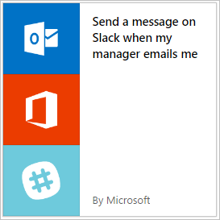

# Creación de un flujo a partir de una plantilla en Microsoft Flow
[!INCLUDE [view-pending-approvals](includes/cc-rebrand.md)]
Cree un flujo a partir de una de las muchas plantillas integradas que pueden, por ejemplo, enviar un mensaje de demora cuando el administrador le envíe un correo electrónico en Office 365.

**Nota:** [cree un flujo desde cero](get-started-logic-flow.md) si ya tiene un proceso en mente y no encuentra una plantilla para él.

**Requisitos previos**

* Una cuenta en [Flow.Microsoft.com](https://flow.microsoft.com)
* Una cuenta de demora
* Credenciales de Office 365

## Elegir una plantilla
<iframe width="560" height="315" src="https://www.youtube.com/embed/ZJK8cYdjAic?list=PL8nfc9haGeb55I9wL9QnWyHp3ctU2_ThF" frameborder="0" allowfullscreen></iframe>

1. En [Flow.Microsoft.com](https://flow.microsoft.com), seleccione **plantillas** en la barra de navegación superior.
2. En la barra de búsqueda, escriba **margen de demora**y, a continuación, seleccione el icono de búsqueda.
3. Solo verá las plantillas relacionadas con la demora, por lo que ahora puede seleccionar **Enviar un mensaje al margen de demora cuando mi administrador me envíe por correo electrónico**.
   
    
4. Confirme que esta plantilla hará lo que desee y, a continuación, seleccione **usar esta plantilla**.
5. Si no ha iniciado sesión en Office o en el margen de demora, seleccione **iniciar sesión** y siga las indicaciones.
   
    
6. Después de confirmar las conexiones, seleccione **continuar**.
   
    Aparece el flujo, que muestra cada acción con una barra de título naranja.
   
    

## Personalización del flujo
1. Seleccione la barra de título de un evento para expandirla y, a continuación, personalícela (por ejemplo, mediante la especificación de un filtro en el correo electrónico que le interese).
2. Las acciones que requieren la entrada de se expandirán automáticamente.
   
    Por ejemplo, la acción **post Message** se expande porque debe especificar un canal, como su *nombre de usuario de\@* . También puede personalizar el contenido del mensaje. De forma predeterminada, el mensaje contendrá solo el asunto, pero puede incluir otra información.
   
    
3. Cerca de la parte superior de la pantalla, especifique un nombre para el flujo y, a continuación, seleccione **Crear flujo**.
4. Por último, si está satisfecho con el flujo, seleccione **listo**.
   
    

Ahora, cuando el administrador le envíe un correo electrónico, recibirá un mensaje de demora que contiene la información que especificó.

## Pasos siguientes
* [Ver el flujo en acción](see-a-flow-run.md)
* [Publicar su propia plantilla](publish-a-template.md)
* [Use una plantilla para el Common Data Service](common-data-model-intro.md)
* Comience a [trabajar con los flujos de equipo](create-team-flows.md) e invite a otros usuarios a colaborar con usted para diseñar flujos.

