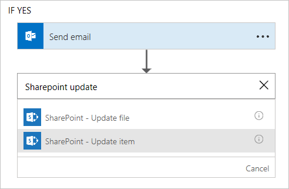

# Solicitudes de aprobación
Además de ayudarle a **recibir notificaciones**, **copiar archivos** y **recopilar datos**, Microsoft Flow también le ayudará a **simplificar los procesos de aprobación**.

## Escenario de vacaciones
Suponga que usted es el **director** de un equipo y le pide a los empleados que creen **solicitudes de vacaciones** en una **lista de SharePoint**. Ahora desea generar un **proceso de aprobación** en torno a estos elementos de lista para que las nuevas solicitudes de vacaciones se **procesen rápidamente** y se le **notifique automáticamente** al solicitante.  

## SharePoint y Microsoft Flow
**SharePoint** trae Microsoft Flow **integrado**.  Desde la **lista de SharePoint**, haga clic en el menú desplegable **Flujo** y, a continuación, en **Crear flujo**.

   

En el **menú de la derecha**, busque una **plantilla** parecida a esta.

## Uso de la plantilla
El desencadenador de **SharePoint** en la plantilla aparece **rellenado previamente** con su información de lista.  Todo lo que tiene que hacer es agregar una **dirección de correo electrónico** para el **aprobador**.  Observe que este **no cambia el elemento de SharePoint original**.  Para ello, necesitamos agregar la acción **SharePoint: actualizar elementos**.

¿Qué sucede con la opción **if no** de *Enviar emailScope*?  De forma predeterminada, no realiza ninguna acción.  Puede agregar una acción para enviar al autor de la solicitud un mensaje informándole de que su solicitud se ha rechazado. 

## Siguiente lección
Ahora revisaremos lo que hemos aprendido en esta sección.

