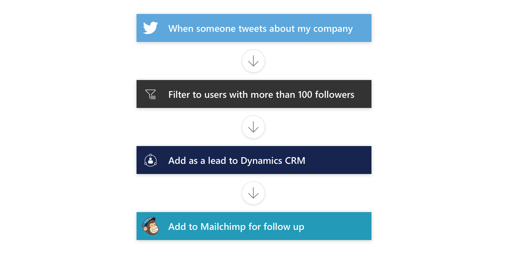

# Aprendizaje guiado de Microsoft Flow
Bienvenido al **aprendizaje guiado** de Microsoft Flow. En este curso autodidáctico en línea se explica Microsoft Flow de forma secuencial, con el fin de que pueden adquirir los conocimientos poco a poco.

Actualmente, este curso de **aprendizaje guiado** solo tiene una sección de introducción y agregaremos el contenido durante las próximas semanas. El curso está diseñado para proporcionar orientación en fragmentos comprensibles, con un flujo lógico que le ayuda a aprender conceptos, detalles y ejemplos. También incluye gran cantidad de elementos visuales que facilitan el aprendizaje.

Si **nunca ha usado** Microsoft Flow, este curso le ayudará a empezar a usarlo y si ya es **veterano** con Microsoft Flow, el curso vinculará los distintos conceptos y rellenará los huecos de conocimiento existentes. Esperamos que disfrute del curso y que en el futuro tenga más contenido.

Este curso de aprendizaje guiado es un **trabajo en curso** continuo.  Por favor, **envíenos sus comentarios** sobre nuestro servicio y díganos **otros temas que desea ver** en este curso.

## ¿Qué es Microsoft Flow?
Microsoft Flow es un **servicio de flujo de trabajo** en línea que le permite trabajar de forma más inteligente y más eficaz mediante la automatización de los flujos de trabajo en los servicios y aplicaciones más comunes.  Microsoft Flow pueden conectarse a más de un centenar de servicio listos para utilizarse cuando el usuario se registre. Microsoft Flow también tiene una aplicación móvil que le ayuda a realizar un seguimiento de los flujos de trabajo sobre la marcha y de las experiencias de administración que se usan en la empresa e incluso puede insertar Microsoft Flow en sus propias aplicaciones.

En este curso, se presentarán Microsoft Flow y sus conceptos, se mostrará cómo se pueden compilar flujos, administrarlos y, como administrador, controlarlos en su entorno. Se proporcionarán tanto la información como los escenarios de uso en una empresa creada para tal fin llamada Contoso Flooring Company.  De esta forma se muestra cómo pueden en su empresa o en las empresas de los clientes los que se crean.

Microsoft Flow no se limita **a las aplicaciones de Internet**.  Se pueden incluir **datos locales** en los flujos, como por ejemplo de SQL Server y SharePoint.

## Función de Microsoft Flow
 Microsoft Flow se puede usar para crear **flujos de trabajo automatizados** entre aplicaciones y servicios favoritos, para sincronizar archivos, obtener notificaciones y recopilar datos, entre otras operaciones.  La [lista de aplicaciones y servicios que se pueden utilizar con Microsoft Flow](https://flow.microsoft.com/services/) crece constantemente.  Estos son algunas de las tareas que se pueden automatizar con Microsoft Flow:

* Recibir y responder al instante notificaciones o correos electrónicos críticos.
* Conseguir y realizar un seguimiento de nuevos clientes potenciales.
* Copiar archivos de un servicio a otro.
* Recopilar datos acerca de su empresa e informar a su equipo.
* Automatizar las aprobaciones.

Microsoft Flow se usa habitualmente para **recibir notificaciones**. Por ejemplo, cada vez que se agregue un cliente potencial a Dynamics 365 o Salesforce, puede recibir un correo electrónico al respecto, o bien recibir una notificación push en la aplicación móvil de su teléfono. Es una forma magnífica de hacer un seguimiento de **nuevos clientes potenciales**.

Microsoft Flow también se puede usar para copiar archivos. Por ejemplo, cada vez que se agrega un archivo a una carpeta de DropBox, se puede copiar automáticamente a una carpeta de SharePoint para **informar a su equipo** que el archivo se encuentra allí.

Si desea ver lo que otros dicen acerca de su empresa, puede **crear un flujo de** que se **desencadene** cada vez que se publique un tweet con un hashtag concreto. El flujo se copiará los detalles del tweet, los colocará en una base de datos SQL, una lista de SharePoint o incluso un archivo de Excel hospedado en OneDrive. Lo que mejor le vaya. Con los datos recopilados, puede crear **acciones** para conectarlos a Power BI, detectar tendencias y formular preguntas acerca de los datos.

Y por último, uno de las mayores usos de Flow es **automatizar aprobaciones**. Por ejemplo, si utiliza una lista de SharePoint para realizar el seguimiento de las aprobaciones de su compañía, podría desencadenar un flujo de trabajo de aprobación.

Para obtener más ideas, examine la lista de **plantillas** de la página **Template Landing** (en la próxima sección encontrará más información al respecto). ¿Tiene alguna idea para un flujo que no aparezca en la lista?  No hay problema.  Puede crear su propia plantilla desde cero y, si lo desea, puede compartirla con la comunidad.

## Creación y administración de flujos
Para crear y administrar flujos, puede usar la aplicación web o la aplicación móvil de Microsoft Flow para [Android](https://aka.ms/flowmobiledocsandroid), [iOS](https://aka.ms/flowmobiledocsios) o [Windows Phone](https://aka.ms/flowmobilewindows). Independientemente de la plataforma que elija, resulta fácil diagnosticar los problemas, sincronizar los datos, etc.:

* Activar o desactivar flujos desde cualquier lugar.
* Vea en qué momento se ha producido un error en un flujo.
* Revisar informes detallados del historial de ejecuciones.
* Ver y filtrar las ejecuciones por tipo de notificación.

## Siguiente lección
Ahora que ya tiene una idea de qué es Microsoft Flow y lo que puede hacer, vamos a examinar lo que hace un flujo.

