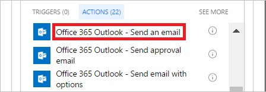

1. Seleccione **Agregar una acción** en la rama **IF NO, DO NOTHING** (En caso negativo, no hacer nada).
2. Escriba **Enviar correo electrónico** en el cuadro de búsqueda de la tarjeta **Elegir una acción**.
   
    
3. Seleccione la acción **Office 365 Outlook - Enviar un correo electrónico**.
   
    
4. Configure la tarjeta de correo electrónico que se adapte a sus necesidades.
   
     Esta tarjeta representa la plantilla de correo electrónico que se envía cuando cambia el estado las solicitudes de vacaciones.

