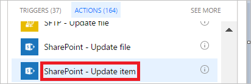

1. Seleccione **Agregar una acción** en la rama **IF YES** (En caso positivo).
1. Escriba **actualizar** en el cuadro de búsqueda de la tarjeta **Elegir una acción**.

    
1. Seleccione la acción **SharePoint - Actualizar elemento**.

    
1. Configure la tarjeta **Actualizar elemento** para que se adapte a sus necesidades.

