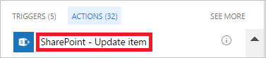

1. Seleccione **Agregar una acción**.
   
    
2. Escriba **actualizar elemento** en el cuadro de búsqueda de la tarjeta **Elegir una acción**.
   
    
3. Seleccione la acción **SharePoint - Actualizar elemento**.
   
    
4. Configure la tarjeta que se adapte a sus necesidades.

