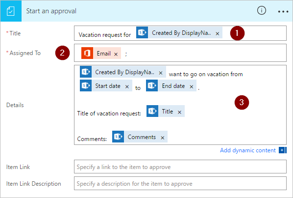

1. Seleccione **Nuevo paso** y, luego, **Agregar una acción**.

    
1. Escriba **aprobación** en el cuadro de búsqueda **Elegir una acción**.

    
1. Seleccione la acción **Approvals - Start an approval** (Aprobaciones - Iniciar una aprobación).

    
1. Configure la tarjeta **Start an approval** (Iniciar una aprobación) para que se adapte a sus necesidades.

     >[!NOTE] 
     > Los campos **Título** y **Asignado a** son necesarios.
     > Puede usar [Markdown](https://aka.ms/approvaldetails) para dar formato al campo **Detalles**.
     > 
     > 

    

