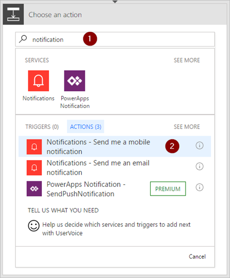

1. Seleccione **Nuevo paso** > **Agregar una acción**.
2. Busque "notificación" y, después, seleccione la acción **Notifications - Send me a mobile notification** (Notificaciones - Enviarme una notificación del servicio móvil).
   
    

