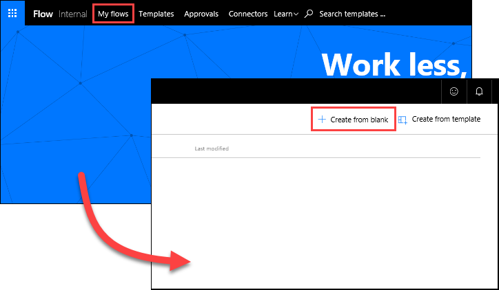
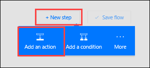
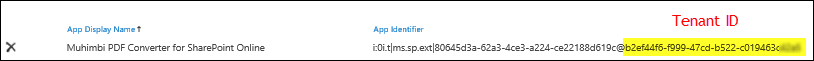
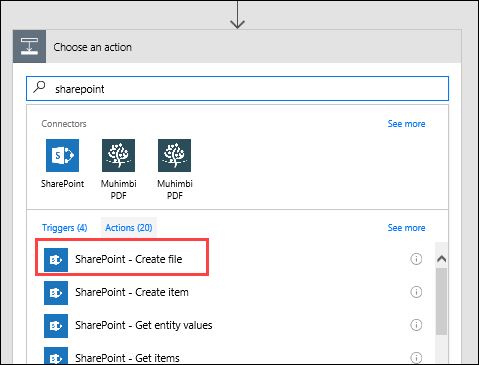

En este tema, podrá ver la forma en que Contoso Flooring usa Microsoft Flow para la conversión automática de documentos a un formato estándar y su posterior almacenamiento en SharePoint Online por motivos de seguridad en la nube. Creará un flujo que detecta cuándo se ha agregado un archivo nuevo a una carpeta de OneDrive para la Empresa y, después, convierte dicho archivo a PDF y lo almacena en una carpeta de SharePoint Online. 

## Requisitos previos
Para este escenario, necesitará una cuenta con **Muhimbi**, un servicio de conversión de PDF. Si no la tiene, puede registrarse para una [evaluación gratuita de 30 días](http://www.muhimbi.com/Products/PDF-Converter-for-SharePoint/Products-PDF-Converter-for-SharePoint-Free-Trial.aspx). Siga las instrucciones que aparecen en la página para implementar la aplicación a través del sitio de SharePoint Online. 

## Creación de las carpetas de origen y de destino
En primer lugar, es preciso que cree las carpetas de origen y de destino en OneDrive para la Empresa y SharePoint Online. 

1. En OneDrive para la Empresa, en **Archivos**, cree una carpeta denominada **Finished Documents**. 
   
    
2. En SharePoint Online, en **Documentos compartidos**, cree una carpeta denominada **PDF – Finished files**. 
   
    

## Creación del flujo
1. En Microsoft Flow, seleccione **Mis flujos** y, después, seleccione **Crear desde cero**. 
   
    
2. Seleccione **Buscar entre cientos de conectores y desencadenadores**.
3. Busque **OneDrive**, seleccione **OneDrive para la Empresa** y, después, seleccione el desencadenador **OneDrive para la Empresa - Cuando se crea un archivo**. En **Carpeta**, seleccione el icono de la carpeta y seleccione la carpeta **Finished Documents** que creó en el paso anterior. 
   
    
4. Seleccione **Nuevo paso** y, luego, **Agregar una acción**. 
   
    
5. Busque **Muhimbi**, seleccione el conector **Muhimbi PDF** conector y seleccione la acción **Muhimbi PDF – Convertir documento**.
   
    
6. En este momento, Microsoft Flow puede pedirle que se autentique en Muhimbi. Para que Microsoft Flow use el servicio Muhimbi, tendrá que registrar Muhimbi mediante su **identificador de inquilino de SharePoint**. 
   
   1. Para buscarlo, seleccione el icono de engranaje de **Configuración** en SharePoint Online y seleccione **Configuración del sitio**.
   2. En **Administración de la colección de sitios**, seleccione **Permisos de aplicación de colección de sitios**. El identificador de inquilino es el identificador que aparece después del símbolo "**@**" símbolos en las listas de la aplicación. 
      
       
7. En la acción **Convertir documento**, establezca los siguientes valores:
   
   * **Nombre de archivo de origen**: en la lista de contenido dinámico, seleccione **Nombre de archivo**.
   * **Contenido de archivo de origen**: en la lista de contenido dinámico, seleccione **Contenido de archivo**.
   * **Formato de salida**: en la lista desplegable, seleccione **PDF**.
     
     

Hasta ahora, ha configurado el flujo con los pasos siguientes: 

1. El flujo se desencadena cuando se agrega un archivo nuevo a una carpeta concreta de OneDrive para la Empresa 
2. El servicio Muhimbi convierte dicho archivo a PDF. 

En el último paso, agregará una acción que se moverá el documento PDF a una carpeta de SharePoint Online a la que puede acceder el equipo.  

1. Seleccione **Nuevo paso** y, luego, **Agregar una acción**.  Busque **SharePoint** y seleccione la acción **SharePoint – Crear archivo**. 
   
    
2. En la acción **Crear archivo**, establezca los siguientes valores:
   
   * **Dirección del sitio**: la dirección URL del sitio de SharePoint.  
   * **Ruta de acceso de la carpeta**: seleccione el icono de la carpeta y navegue a la carpeta **PDF - Finished files**.
   * **Nombre de archivo**: en la lista de contenido dinámico de **Convertir documento**, seleccione **Base file name** y agregue "**.pdf**" para que se guarde en SharePoint con la extensión de archivo. 
   * **Contenido del archivo**: en la lista de contenido dinámico de **Convertir documento**, seleccione **Processed file content**.
3. Seleccione **Crear flujo** en la parte superior de la página para guardar el trabajo.
   
    

## Prueba del flujo
1. Para probar el flujo, agregue un nuevo archivo a la carpeta **Finished Documents** en OneDrive para la Empresa. 
2. En Flow, seleccione **Mis flujos**y, después, seleccione el nuevo flujo para ver el historial de ejecución. De forma predeterminada, el flujo está configurado para que se ejecute cada cinco minutos. 
3. Una vez que se ejecute el flujo, compruebe que el archivo se ha convertido a PDF y se ha guardado en la carpeta **PDF - Finished files** de SharePoint. 
   
    

