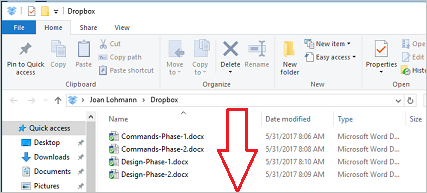
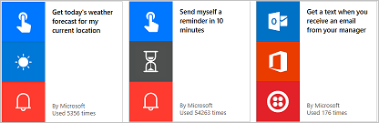

Bienvenido al aprendizaje guiado de Microsoft Flow. En este **curso en línea autodidáctico** se explica Microsoft Flow de forma secuencial, con el fin de que pueda adquirir los conocimientos poco a poco. El curso está diseñado para proporcionar **instrucciones en fragmentos comprensibles** con gran cantidad de **objetos visuales y ejemplos**, y sigue una progresión lógica que le facilita el aprendizaje de los principios y los detalles.

En este curso, aprenderá qué es Microsoft Flow y sus conceptos, verá cómo **generar flujos** y **administrarlos** en su entorno. Se usarán tanto la información como los escenarios de una compañía ficticia denominada Contoso Flooring, pero verá cómo usar los mismos escenarios en su empresa o en las de los clientes.

Si es la primera vez que usa Microsoft Flow, este curso le ayudará a ponerse en marcha. Si ya tiene cierta experiencia, este curso conectará concepto y rellenará los huecos que le queden. Este curso es muy dinámico, así que **envíenos sus opiniones acerca del mismo** e indíquenos si desea ver otros temas en él.

## ¿Qué es Microsoft Flow?
Microsoft Flow es un **servicio de flujo de trabajo** en línea que le permite trabajar de forma más inteligente y más eficaz mediante la **automatización de los flujos de trabajo** en los servicios y aplicaciones más comunes. Por ejemplo, puede crear un flujo que agregue un cliente potencial a **Dynamics 365** y un registro en **MailChimp** cada vez que alguien con más de 100 seguidores envíe un tweet acerca de su empresa.

Al suscribirse, puede **conectarse a más de 100 servicios** y **administrar datos procedentes tanto de la nube como de su entorno local orígenes** como SharePoint y SQL Server. La lista de aplicaciones y servicios que se pueden utilizar con Microsoft Flow crece constantemente.

## Función de Microsoft Flow
Microsoft Flow se puede usar para **automatizar flujos de trabajo** entre las **aplicaciones y servicios favoritos**, sincronizar archivos, obtener notificaciones y recopilar datos, entre otras operaciones. 

Por ejemplo, se pueden **automatizar** estas tareas:

* Responder inmediatamente a notificaciones o mensajes de correo electrónico de alta prioridad.
* Captar y realizar un seguimiento de nuevos clientes potenciales.
* Copiar archivos de un servicio a otro.
* Recopilar datos de su empresa y compartir dicha información con su equipo.
* Automatizar los flujos de trabajo de aprobación.

Microsoft Flow se usa habitualmente para **recibir notificaciones**. Por ejemplo, es posible recibir al instante un correo electrónico o una notificación push en el teléfono cada vez que se agregue cliente potencial a Dynamics 365 o Salesforce.

**Microsoft Flow también se puede usar para copiar archivos**. Por ejemplo, puede tener la certeza de que todos los archivos que se agregan a Dropbox se **copian automáticamente** en SharePoint, donde su equipo puede encontrarlos.

 

 

También permite **supervisar las opiniones** acerca de su empresa mediante la creación de un flujo que se ejecute cada vez que **alguien envíe un tweet** con un determinado hashtag. El flujo podría insertar los detalles de dicho tweet en una base de datos de SQL Server, una lista de SharePoint o incluso un archivo de Excel hospedados en OneDrive (o el servicio que utilice). Con los datos que recopile, puede crear acciones para conectarlos a Power BI, detectar tendencias y formular preguntas acerca de los datos.

Y, por último, **puede automatizar los bucles de aprobación** de, por ejemplo, las solicitudes de vacaciones en una lista de SharePoint.

Para encontrar más ideas, **examine la lista de plantillas**, que resultan de gran ayuda para crear flujos en unos pocos pasos. Por ejemplo, puede crear fácilmente flujos para **enviarse a sí mismo previsiones meteorológica**, recordatorios a intervalos regulares o notificaciones de teléfono cada vez que el administrador le envía un mensaje de correo.

¿Tiene alguna idea para algún flujo que no se encuentra en la lista? Créelo desde cero y, si lo desea, puede compartirlo con el resto de usuarios.

## ¿Dónde se pueden crear y administrar los flujos?
Tanto la creación de los flujos como las tareas administrativas se pueden llevar a cabo **en un explorador** o **desde un teléfono** (si se descarga la aplicación móvil para Microsoft Flow).

  

Puede realizar estas tareas, entre otras:

* Activar o desactivar flujos desde cualquier lugar.
* Vea en qué momento se ha producido un error en un flujo.
* Revisar informes detallados del historial de ejecuciones.
* Ver y filtrar las ejecuciones por tipo de notificación.

## Un breve paseo por Microsoft Flow
Pasemos a la herramienta para mostrársela. Disponemos de gran cantidad de información acerca del uso de Microsoft Flow.

En la página principal, se encuentran los siguientes menús:

* **Mis flujos**, donde están los flujos.
* **Plantillas**, que es un magnífico lugar desde donde comenzar.
* **Aprobaciones**, donde puede automatizar y simplificar el proceso de aprobación.
* **Conectores** (anteriormente **Servicios**), donde puede conectarse de un servicio a otro.
* **Más información**, donde puede obtener información que le ayudará a progresar rápidamente en Microsoft Flow.

Por ahora, nos centraremos en **Más información**, que contiene:

* **Aprendizaje guiado** puede guiarle en el uso de Microsoft Flow, desde las técnicas más básicas a escenarios avanzados.
* **Documentación** es donde se encuentran los temas avanzados. Si desea conocer una característica o una función en profundidad, puede adentrarse aquí para descifrar todos sus secretos.
* **Soporte técnico** es un excelente lugar en el que empezar a buscar ayuda.
* **Comunidad** es un lugar para conectar con otras personas que utilizan Microsoft Flow y conocer cómo lo hacen.
* **Enviar comentarios** permite sacar provecho de una comunidad de usuarios avanzados, ya que puede **enviar comentarios y preguntas** tanto a desarrolladores como a otros usuarios.
* **Blog** le mantiene al día acerca de los desarrollos y lanzamiento más recientes en el ecosistema de Microsoft Flow.
* **Precios** puede ayudarle a elegir el plan adecuado para usted o su empresa.

En la página **Plantillas**, puede encontrar algunas de las plantillas más populares, que pueden aportarle ideas interesantes acerca de flujos que desea probar.

## Siguiente lección
Ahora que ya tiene una idea de qué es Microsoft Flow y lo que puede hacer, vamos a examinar lo que hace un flujo.

