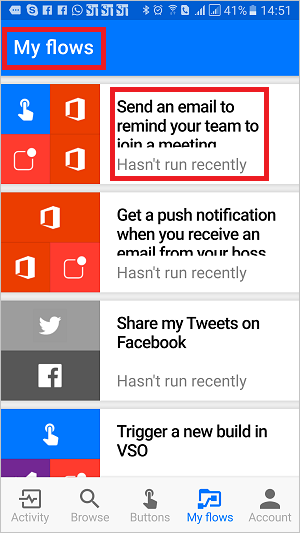

# Introducción a los flujos de botón
[!INCLUDE [view-pending-approvals](includes/cc-rebrand.md)]
## ¿Qué son los flujos de botón?
Hay muchas tareas repetitivas que se quieren ejecutar con solo pulsar un botón. Por ejemplo, puede que tenga que enviar por correo electrónico rápidamente a su equipo para recordarle que se una a la sincronización diaria del equipo, o bien puede iniciar una nueva compilación de Visual Studio online de su código base después de haber notificado que no hay más protecciones planeadas para el día. Los flujos de botón permiten realizar estas y muchas otras tareas simplemente pulsando un botón en el dispositivo móvil.

**Nota:** Puede crear flujos de botón desde el dispositivo móvil o desde el portal de Flow.  
    

## ¿Por qué crear botones?
Cree botones para poder ejecutar fácilmente tareas repetitivas desde cualquier lugar y en cualquier momento a través de su dispositivo móvil. La ejecución de botones le ahorra tiempo y, dado que las tareas que realizan se automatizan, habrá menos errores que si lo hiciera manualmente.  

## Crear un botón
### Requisitos previos
* Acceso al flujo. El administrador puede proporcionarle acceso.
* Una cuenta con permisos para usar los conectores para crear el botón. Por ejemplo, necesitará una cuenta de Dropbox para crear un botón que acceda a Dropbox.

### Desde el portal
En este tutorial, vamos a crear un botón que inicia una compilación de Visual Studio online (VSO) y envía notificaciones para que sepa cuándo se inicia la compilación:  

1. Seleccione la lista desplegable **Mostrar** y elija la categoría de **botón** . Esto filtra la lista de plantillas para solo las que se pueden usar en los flujos de botón.  
      
2. Seleccione la plantilla **desencadenar una nueva compilación de VSO en** la lista de plantillas.  
     
3. Seleccione el botón **usar esta plantilla** en la página **desencadenar una nueva compilación de VSO** .   
     
4. Si no ha iniciado sesión, se le pedirá que lo haga en este momento:  
     
5. Una vez iniciada la sesión en Flow, se le pedirá que inicie sesión en los conectores usados en la plantilla que ha seleccionado. En este ejemplo, en el paso 2, se ha seleccionado la plantilla **desencadenar una nueva compilación en VSO** , por lo que tenemos que iniciar sesión en VSO (y en cualquier otro conector con el que esté trabajando) si aún no ha iniciado sesión:  
       
6. Seleccione el botón **Aceptar** si acepta autorizar el flujo para acceder a su cuenta de VSO.  
      
   **Nota:** Tendrá que autorizar cada conector de la misma manera. El diseñador debe aparecer como este cuando esté listo para pasar al paso siguiente. Seleccione el botón **continuar para continuar** :  
      
7. Ahora está listo para configurar las propiedades de la compilación que desea iniciar:    
     
8. Seleccione o escriba el **nombre**de la cuenta, el **nombre del proyecto**, el identificador de la **definición de compilación**, la **rama de origen** y, opcionalmente, **los parámetros**, en la **cola de una nueva compilación** :    
     
9. A continuación, configure las propiedades de la notificación de extracción en la tarjeta **enviar una notificación de extracción** . De forma predeterminada, esta notificación de extracción está configurada para enviar un vínculo HTML a una página web que muestra el estado de la compilación:  
     
10. Seleccione el botón **Crear flujo** para guardar el flujo de botón:   
11. Debería ver este mensaje de operación correcta en unos momentos:  
      

Enhorabuena, ha creado un flujo de botones. Ahora puede ejecutar este flujo de botón en cualquier momento y lugar desde la pestaña **botones** de la aplicación Flow. Simplemente presione el "botón" y se ejecutará. La aplicación móvil Microsoft Flow está disponible para [Android](https://aka.ms/flowmobiledocsandroid), [iOS](https://aka.ms/flowmobiledocsios)o [Windows Phone](https://aka.ms/flowmobilewindows).

### Desde el dispositivo móvil
**Nota**: aunque en este tutorial se muestran las pantallas de un dispositivo Android, las pantallas y la experiencia en un dispositivo iOS son similares.

En la aplicación Flow:

1. Seleccione la pestaña **Browse (examinar** ) y desplácese hasta la categoría Button ( **botón** ).  
     
2. Seleccione el vínculo **ver todo** . Esto muestra todas las plantillas de botón listas para usar.     
     
3. Seleccione la plantilla **Enviar un correo electrónico para recordar a su equipo que se va a unir a una reunión**    
     
4. Seleccione el vínculo **usar esta plantilla** en la parte inferior de la página.    
     
5. Deberá iniciar sesión en todos los servicios que usa esta plantilla:    
     
6. Seleccione el vínculo **siguiente** después de haber iniciado sesión en todos los servicios.      
     
7. Seleccione el vínculo **crear** . Aquí también puede revisar el flujo y realizar los cambios necesarios para personalizar el correo electrónico, por ejemplo.        
     
8. Transcurridos unos instantes, se crea el flujo de botones. Seleccione **ver mi flujo**:   
     
9. Visualización de todos los flujos en la pestaña **Mis flujos**  
     

Enhorabuena, ha creado un flujo de botones. Ahora puede ejecutar este flujo de botón en cualquier momento y lugar desde la pestaña **botones** de la aplicación Flow. Simplemente presione el "botón" y se ejecutará. La aplicación Flow está disponible actualmente en dispositivos móviles iOS y Android.  

  

## Desencadenar un flujo de botón
Ahora que ha creado un flujo de botones, es el momento de ejecutarlo. Dado que solo puede ejecutar flujos de botón desde la aplicación Flow, asegúrese de que ha instalado Flow en el dispositivo móvil Android o iOS.  

1. Ahora, inicie la aplicación Flow, pulse la pestaña **Buttons (botones** ) que se encuentra en la parte inferior de la página y pulse el *botón* que representa el flujo de botón que desea desencadenar:  
      
2. Vea el progreso mientras se ejecuta el flujo:  
      
3. Por último, se actualiza la página, lo que indica que se ha completado el flujo de botones:  
      

Eso es todo lo que hay que hacer para ejecutar un flujo. 

Ahora debería recibir la notificación de la extracción, que indica que se ha enviado el correo electrónico.  

## Supervisión de las ejecuciones de flujo de botones
Puede supervisar los flujos de botón en la pestaña **actividad** de la aplicación Flow:   
  

**Nota**: Pulse cualquier actividad para profundizar en los resultados de la ejecución y obtener información sobre la ejecución.  

  

## Administrar flujos de botón
Tiene el control total de los flujos de botones para que pueda habilitar o deshabilitar, editar o eliminar un botón en cualquier momento y en cualquier lugar. En la aplicación móvil o en el portal de Flow, seleccione **Mis flujos** para empezar a administrar los flujos.    

En la pestaña **Mis flujos** de la aplicación Flow:

1. Seleccione el flujo que desea administrar:    
      
2. Puede pulsar cualquiera de estas opciones, en función de lo que le gustaría realizar:    
     
3. Puntee en **eliminar flujo** para eliminar un flujo.  

**Nota:** Todo el historial de ejecución se elimina al eliminar un flujo:   
   

1. Pulse en **Actualizar** cuando haya terminado de editar un flujo de botones para guardar los cambios:   
      
2. Pulse en **historial de ejecución** para ver los resultados de todas las ejecuciones de un flujo de botones determinado:    
     
3. Si deshabilita un flujo, ya no estará disponible en la pestaña **botones** :    
     

## Pasos siguientes
* [Compartir flujos de botones](share-buttons.md).
* Aprenda a usar [tokens de desencadenadores de botones](introduction-to-button-trigger-tokens.md) para enviar datos en tiempo real cuando se ejecuten los flujos de botón.
* Instale la aplicación móvil Microsoft Flow para [Android](https://aka.ms/flowmobiledocsandroid), [iOS](https://aka.ms/flowmobiledocsios)o [Windows Phone](https://aka.ms/flowmobilewindows).

