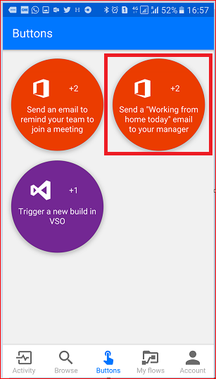

# Introducción a los tokens de desencadenadores de botón
[!INCLUDE [view-pending-approvals](includes/cc-rebrand.md)]
## ¿Qué son los tokens de desencadenadores de botón?
Los tokens de desencadenadores de botones son puntos de datos que se conocen y están disponibles para el dispositivo en el que se ejecuta un [flujo de botones](introduction-to-button-flows.md) . Estos tokens cambian en función de factores como la hora actual o la ubicación geográfica del dispositivo en un momento dado.  

Por ejemplo, si está ejecutando un flujo de botones en un smartphone, es probable que el **teléfono sepa la hora** de la ubicación actual, así como la fecha y la dirección actual. En este contexto, la hora, la fecha y la dirección en la que se encuentra el teléfono se determinan en el momento en que se ejecuta el flujo de botones. Están disponibles automáticamente para su uso en cualquier flujo de botones que se ejecute en el dispositivo. Puede usar estos tokens de desencadenador para generar flujos útiles que minimizarán las tareas repetitivas, como proporcionar su ubicación a alguien o realizar un seguimiento de la cantidad de tiempo empleado en una llamada a un trabajo o servicio determinado.

### Lista de tokens de desencadenadores de botón
Esta es la lista de los tokens de desencadenadores de botón que están disponibles para su uso al crear los flujos de botón.

| Parámetro | Denominación |
| --- | --- |
| Ciudad |La ciudad en la que se encuentra el dispositivo que está ejecutando el flujo. |
| País o región |El país o región en el que se encuentra el dispositivo que está ejecutando el flujo. |
| Dirección completa |La dirección completa en la que se encuentra el dispositivo que está ejecutando el flujo. |
| Latitude |La latitud en la que se encuentra el dispositivo que está ejecutando el flujo. |
| Longitud |La longitud en la que se encuentra el dispositivo que está ejecutando el flujo. |
| CódPostal |Código postal en el que se encuentra el dispositivo que está ejecutando el flujo. |
| State |El estado en el que se encuentra el dispositivo que está ejecutando el flujo. |
| Calle |La calle en la que se encuentra el dispositivo que está ejecutando el flujo. |
| Indicaciones |La hora en el área donde se encuentra el dispositivo que está ejecutando el flujo. |
| Posteriormente |La fecha en el área donde se encuentra el dispositivo que está ejecutando el flujo. |
| Nombre de usuario |El nombre de usuario de la persona que inició sesión en el dispositivo que está ejecutando el flujo. |
| Correo electrónico del usuario |La dirección de correo electrónico de la persona que inició sesión en el dispositivo que está ejecutando el flujo. |

## Crear un flujo de botones que use tokens de desencadenadores
Al crear un botón, puede usar tokens de desencadenador para agregar una funcionalidad enriquecida al botón.

En este tutorial, se creará un flujo de botones en un dispositivo Android. El flujo de botones usará tokens de desencadenador para enviar la fecha y la dirección completa en un correo electrónico "**trabajo desde casa**" a su jefe.

En este tutorial, verá capturas de pantalla de un dispositivo Android; sin embargo, la experiencia es similar en dispositivos iOS y Windows Phone también.

### Requisitos previos
* Una dirección de correo electrónico profesional o educativa o una [cuenta de Microsoft](https://account.microsoft.com/about?refd=www.microsoft.com) con acceso a Microsoft Flow.
* La aplicación móvil Microsoft Flow para [Android](https://aka.ms/flowmobiledocsandroid), [iOS](https://aka.ms/flowmobiledocsios)o [Windows Phone](https://aka.ms/flowmobilewindows).

Comencemos:

1. Inicie el flujo y seleccione **examinar**   
     
2. Seleccione el **correo electrónico para enviar un trabajo desde casa hoy a su** servicio de administrador en la categoría de **botón**   
     
3. Seleccione **usar esta plantilla**  
     
4. Seleccione **Editar** en la tarjeta **Enviar un correo electrónico** .  
     
5. Puntee en el cuadro de texto **asunto** y escriba: " **hoy-** " en el cuadro de texto después del texto "WFH". Tenga en cuenta que al puntear en el cuadro de texto, también se abre una lista de parámetros o tokens. Usaremos uno de estos tokens en el paso siguiente para agregar la fecha al asunto del correo electrónico.  
     
6. Con el cursor todavía en el cuadro de texto asunto, desplácese a la lista **manual** de parámetros y pulse **fecha**. Observe que el parámetro fecha está ahora en el cuadro de texto **asunto** :  
     
7. Desplácese hasta el cuadro de texto **cuerpo** y pulse después del mensaje predeterminado para que se puedan incluir en ella otros tokens.  
     
8. Puntee en el parámetro **dirección completa** y, a continuación, en **crear** .  
     
9. Pulse **listo**. Ahora se crea el flujo de botones.  
     

## Ejecutar el flujo de botón
**Nota**: este flujo de botones enviará su ubicación actual por correo electrónico.  

1. Puntee en la categoría **botones** en la parte inferior de la pantalla. Verá una lista de los botones para los que tiene permisos de uso. Puntee en el botón que representa el flujo de botón que acaba de crear:  
     
2. Pulse **permitir** para indicar que es correcto que el flujo de botón tenga acceso a la información de ubicación del dispositivo:  
     
3. En unos momentos, observe que el correo electrónico se envió a su jefe:  
     

Enhorabuena, acaba de crear un flujo de botones que usa los tokens de desencadenador de dirección completa y de fecha. 

## Pasos siguientes
* [Compartir flujos de botones](share-buttons.md)
* [Más información sobre los flujos de botón](introduction-to-button-flows.md)
