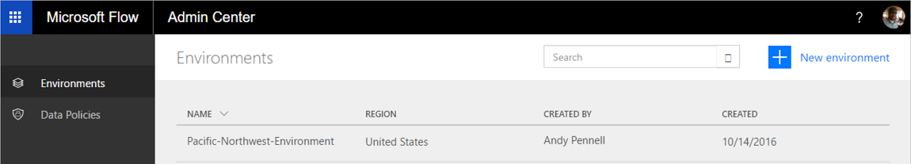

# El Centro de administración
  

## ¿Qué es el Centro de administración?
El Centro de administración es la ubicación central donde los administradores de inquilinos y los administradores de entornos administran entornos y directivas de prevención de pérdida de datos (DLP) para una organización. Los cambios que se realicen en el Centro de administración estarán disponibles inmediatamente para los usuarios de la organización.  

## Acceso al Centro de administración
* Al Centro de administración de Flow se accede a través de https://admin.flow.microsoft.com.   

## Entornos
Obtenga más información acerca de cómo se utilizan los [entornos](environments-overview-admin.md) para administrar usuarios, permisos y roles.  

## Directivas de prevención de pérdida de datos (DLP)
Obtenga más información acerca de cómo se usan las [directivas de prevención de pérdida de datos](prevent-data-loss.md) para crear reglas que administran cómo se comparten los datos profesionales entre servicios de los flujos.  

## Pasos siguientes
* [Más información acerca de los entornos](environments-overview-admin.md)   
* [Más información sobre Microsoft Flow](getting-started.md)   

