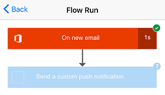

# Administrar flujos en Microsoft Flow desde el teléfono
[!INCLUDE [view-pending-approvals](includes/cc-rebrand.md)]
Vea una lista de todos los flujos creados y, para cada flujo, ver sus eventos y acciones, habilitarlos o deshabilitarlos y explorar su historial de ejecución.

**Requisitos previos**

* Instale la aplicación móvil Microsoft Flow para [Android](https://aka.ms/flowmobiledocsandroid), [iOS](https://aka.ms/flowmobiledocsios)o [Windows Phone](https://aka.ms/flowmobilewindows) en un [dispositivo compatible](getting-started.md#use-the-mobile-app). Los gráficos de este tema reflejan la versión de iPhone de la aplicación, pero los gráficos en Android y Windows Phone tienen un aspecto similar.
* Si aún no tiene un flujo, cree uno en [el sitio web para Microsoft Flow](https://flow.microsoft.com/). Para facilitar las pruebas, use una que pueda desencadenarse a sí mismo en lugar de esperar a un evento externo.

El flujo de este tutorial se ejecuta cuando recibe correo de una dirección específica:

Puede configurar este tipo de flujo con su dirección de correo electrónico personal para las pruebas y otra dirección (por ejemplo, el administrador) cuando el flujo esté listo para su uso real.

Cuando se ejecuta el flujo, envía una notificación de envío personalizada con esta sintaxis a su teléfono:

**Nota**: también puede [supervisar la actividad de flujo](mobile-monitor-activity.md) desde la aplicación móvil.

## Administrar un flujo
1. Abra la aplicación móvil y pulse **Mis flujos** en la parte inferior de la pantalla para mostrar todos los flujos.
   
    Cada entrada muestra el nombre del flujo, los iconos de sus eventos y acciones, la hora a la que se ejecutó más recientemente y un icono que indica si la ejecución más reciente se realizó correctamente.
   
    
2. Puntee en un flujo para mostrar las opciones para administrarlo.
   
    
3. Puntee en el control de alternancia **Habilitar flujo** para habilitar o deshabilitar el flujo.
4. Puntee en **Ver flujo** para mostrar los eventos y las acciones de ese flujo, puntee en cada evento o en una acción para expandirlo y, a continuación, en **atrás**.
   
    
5. Pulse en **historial de ejecución** para mostrar los éxitos del flujo, los errores o ambos.
   
    
6. Puntee en una ejecución para mostrar si cada evento y acción se realizaron correctamente y, en caso afirmativo, cuánto tiempo (en segundos) tardó.
   
    

