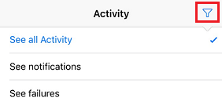

# Supervisión de la actividad en Microsoft Flow desde el teléfono
[!INCLUDE [view-pending-approvals](includes/cc-rebrand.md)]
Vea un resumen del número de veces que cada flujo se ha realizado correctamente o con errores hoy, ayer y días anteriores. Explore los detalles de cada ejecución, como Cuándo se ejecutó, cuánto tiempo tardó cada paso y, si se produjo un error, por qué.

**Requisitos previos**

<iframe width="560" height="315" src="https://www.youtube.com/embed/vZuYZ64K3tI?list=PL8nfc9haGeb55I9wL9QnWyHp3ctU2_ThF" frameborder="0" allowfullscreen></iframe>

* Instale la aplicación móvil Microsoft Flow para [Android](https://aka.ms/flowmobiledocsandroid), [iOS](https://aka.ms/flowmobiledocsios)o [Windows Phone](https://aka.ms/flowmobilewindows) en un [dispositivo compatible](getting-started.md#use-the-mobile-app). Los gráficos de este tema reflejan la versión de iPhone de la aplicación, pero los gráficos en Android y Windows Phone son similares.
* Si aún no tiene un flujo, cree uno en [el sitio web para Microsoft Flow](https://flow.microsoft.com/). Para facilitar las pruebas, use una que pueda desencadenarse a sí mismo en lugar de esperar a un evento externo.

El flujo de este tutorial se ejecuta cuando recibe correo de una dirección específica:

Puede configurar este tipo de flujo con su dirección de correo electrónico personal para las pruebas y otra dirección (por ejemplo, el administrador) cuando el flujo esté listo para su uso real.

Cuando se ejecuta el flujo, envía una notificación de envío personalizada con esta sintaxis a su teléfono:

**Nota:** También puede [administrar los flujos](mobile-manage-flows.md) desde la aplicación móvil.

## Mostrar un resumen de la actividad
<iframe width="560" height="315" src="https://www.youtube.com/embed/nVCGJamOw6s?list=PL8nfc9haGeb55I9wL9QnWyHp3ctU2_ThF" frameborder="0" allowfullscreen></iframe>

1. Si el flujo no se ha ejecutado antes, desencadene una ejecución para generar datos.
   
    Los datos pueden tardar algún tiempo en aparecer en la aplicación.
2. Abra la aplicación móvil, que muestra la pestaña **actividad** de forma predeterminada.
   
    En esta pestaña se organizan los datos por día, con los datos de hoy en la parte superior.
   
    
   
    Cada entrada muestra el nombre de un flujo con iconos que corresponden a sus eventos y acciones del desencadenador.
   
    
   
    Si al menos una de las ejecuciones de un flujo se ha realizado correctamente en un día, una entrada muestra el número de éxitos y la hora a la que se realizó por última vez. Una entrada diferente muestra información similar si se ha producido un error en un flujo.
   
    
   
    Si un flujo envía una notificación de inserción, el texto de la notificación más reciente aparece en la parte inferior de la entrada para las ejecuciones correctas.
   
    
3. Si se enviaron varias notificaciones de envío en un día, deslice el dedo hacia la izquierda en la notificación para ver las notificaciones de hasta tres ejecuciones anteriores. Si se enviaron más de cuatro notificaciones en un día, deslice el dedo hacia la izquierda hasta que aparezca **más** y, a continuación, Púlselo para ver una lista de todas las notificaciones.
   
    
4. Pulse en **atrás** para volver al Resumen de la actividad.
5. Para filtrar el Resumen de la actividad, puntee en el icono de la esquina superior derecha.
   
    Puede mostrar todas las entradas, solo las entradas de error o solo las entradas que incluyen notificaciones de envío.
   
    

## Mostrar detalles de una ejecución
1. En el Resumen de la actividad, puntee en una entrada para mostrar los detalles de la ejecución más reciente.
   
     Cada evento y acción aparece con un icono que indica si el evento o la acción se ha realizado correctamente o no. Si se realiza correctamente, también aparece la cantidad de tiempo que tardó (en segundos).
   
    
2. En la parte inferior de la pantalla, puntee en **Ver ejecuciones anteriores** para obtener una lista de todas las ejecuciones del flujo y, a continuación, puntee en una ejecución para mostrar sus detalles.
   
    

