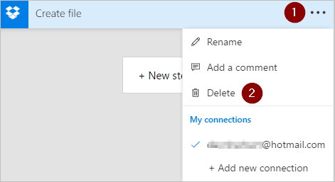

# Agregar varias acciones y opciones avanzadas a un flujo
[!INCLUDE [view-pending-approvals](includes/cc-rebrand.md)]
Personalice un flujo agregando una o varias opciones avanzadas y varias acciones para el mismo desencadenador. Por ejemplo, agregue una opción avanzada que envíe un mensaje de correo electrónico con prioridad alta. Además de enviar correo cuando se agrega un elemento a una lista de SharePoint, cree un archivo en Dropbox que contenga la misma información.

## Requisitos previos
* [Creación de un flujo](get-started-logic-flow.md)

## Agregar otra acción
En este procedimiento, agregará una acción en el centro del flujo. Esta acción guardará un archivo en Dropbox y archivará el elemento en la lista.

1. En [Flow.Microsoft.com](https://flow.microsoft.com), seleccione **Mis flujos** en la barra de navegación superior.
2. En la lista de flujos, seleccione el flujo que desea editar.
3. Seleccione **nuevo paso**y, a continuación, seleccione **Agregar una acción**.
   
    
4. En la lista de acciones posibles, busque **crear archivo**y, a continuación, seleccione **Dropbox-crear archivo**.
   
    
5. Si se le solicita, proporcione sus credenciales de Dropbox.
6. Seleccione el icono de carpeta en el lado derecho del cuadro **ruta de acceso** de la carpeta.
7. Busque y, a continuación, seleccione la carpeta en la que desea colocar el nuevo archivo.
   
    
8. Escriba el nombre del nuevo archivo en el cuadro **nombre de archivo** . Asegúrese de anexar una extensión, como ". txt", al nombre de archivo. Aquí, vamos a usar **TweetId** en el nombre del archivo para garantizar la unicidad de los archivos. Es posible que tenga que seleccionar **Ver más** para encontrar el token de **TweetId** .
9. Agregue el texto que desea que contenga el archivo escribiendo en el cuadro **contenido del archivo** . También puede Agregar tokens en el cuadro **contenido del archivo** .
   
    
   
   > [!IMPORTANT]
   > Si asigna al archivo un nombre que coincida con el nombre de un archivo existente (en la carpeta seleccionada), se sobrescribirá el archivo existente.
   > 
   > 
10. Seleccione **Actualizar flujo**, que se encuentra en el menú de la parte superior de la pantalla.
11. Envíe un Tweet que contenga la palabra clave que ha especificado.
    
     En un minuto, se crea un archivo en la cuenta de Dropbox.

## Reordenar o eliminar una acción
* Para recibir el correo electrónico después de crear el archivo en Dropbox, mueva la acción de Dropbox arrastrando su barra de título sobre la acción de correo electrónico. Suelte la acción de Dropbox sobre la flecha entre el desencadenador (**cuando se publique un nuevo Tweet**) y la acción de correo electrónico. (El cursor indica si la acción está correctamente colocada).
  
  > [!NOTE]
  > No se puede desplazar un paso antes de otro si usa cualquier resultado de ese paso.
  > 
  > 
  
    
* Para eliminar una acción, seleccione los puntos suspensivos (...) situados cerca del borde derecho de la barra de título de la acción que desea eliminar, seleccione **eliminar**y, a continuación, haga clic en **Aceptar**.
  
    
  
     **Nota:** No se puede eliminar una acción si se usan resultados de ella en cualquier parte del flujo. En primer lugar, quite las salidas de los campos y, a continuación, puede eliminar la acción.

## Acciones de copiar y pegar

Si desea duplicar acciones mientras diseña un flujo, puede copiarlos y pegarlos. Por ejemplo, si va a compilar una condición y desea acciones similares en el lado **sí** y en **si no hay ningún** lado, en lugar de crear ambas acciones desde el principio, puede compilar la primera acción en un lado y, a continuación, copiarla al otro lado.

### Para copiar una acción
1. Seleccione el menú de acción (... en la parte superior derecha de la acción).
1. Seleccione **Copiar en el portapapeles**. 
1. Seleccione el **nuevo paso** en el que desea que se realice la acción. 

     Observe la pestaña **mi portapapeles** , que le permite elegir entre todas las acciones que ha copiado.
1. Seleccione el elemento que desea pegar.

## Agregar opciones avanzadas
Comience con un flujo que tenga una acción **Enviar un correo electrónico** .

1. Seleccione **Mostrar opciones avanzadas**, que se encuentra en la parte inferior de la tarjeta **Enviar un correo electrónico** .
   
     A continuación, verá las opciones avanzadas para enviar un correo electrónico.
   
    
2. Seleccione **alto** en la lista **importancia** y, a continuación, seleccione **Ocultar opciones avanzadas** para ocultar las opciones avanzadas.
3. Seleccione **Actualizar flujo**, que se encuentra en el menú de la parte superior de la pantalla.
   
     Este paso guarda los cambios.

