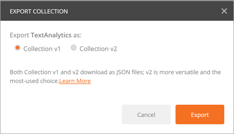

# Descripción de un conector personalizado con Postman
[Postman](https://www.getpostman.com/) es una herramienta que sirve para realizar el desarrollo de API más rápido y sencillo. Este tutorial muestra cómo crear una colección Postman que, a continuación, puede utilizar para crear fácilmente [conectores personalizados](register-custom-api.md) en Microsoft Flow.

## Requisitos previos
* Instale la [aplicación Postman](https://www.getpostman.com/apps).

## Crear una colección Postman
Vamos a crear una colección Postman para [Text Analytics API](https://www.microsoft.com/cognitive-services/text-analytics-api) de Azure Cognitive Services. Esta API identifica el idioma, las opiniones y las frases clave del texto que se le pasa.

1. El primer paso para crear una colección Postman es crear una solicitud. Al crear la solicitud, puede establecer el verbo HTTP, la URL de solicitud, los parámetros de consulta o de ruta de acceso, los encabezados y el cuerpo. Para más información, consulte [Sending Requests](https://www.getpostman.com/docs/requests) (Envío de solicitudes) en la documentación de Postman. Como punto de conexión de Detect Language API, establezca los valores como se indica a continuación:
   
    
   
    Detalles de los parámetros y valores usados:
   
   | Parámetro | Valor |
   | --- | --- |
   | Verb |POST |
   | Request URL |https://westus.api.cognitive.microsoft.com/text/analytics/v2.0/languages |
   | Params |numberOfLanguagesToDetect |
   | Authorization |“No Auth” |
   | Headers |Ocp-Apim-Subscription-Key = <your subscription key>  Content-Type = application/json |
   | Body |<code>{ &nbsp;&nbsp;&nbsp;"documents": [ &nbsp;&nbsp;&nbsp;&nbsp;&nbsp;{ &nbsp;&nbsp;&nbsp;&nbsp;&nbsp;&nbsp;&nbsp;&nbsp;"id": "1", &nbsp;&nbsp;&nbsp;&nbsp;&nbsp;&nbsp;&nbsp;&nbsp;"text": "Hello World" &nbsp;&nbsp;&nbsp;&nbsp;&nbsp;} &nbsp;&nbsp;] }<code> |
2. Haga clic en **Enviar** para realizar la solicitud y devolver la respuesta.
3. Haga clic en **Guardar** para guardar la solicitud en una colección Postman.
   
    
4. Proporcione un **nombre de solicitud** y una **descripción de solicitud** en el cuadro de diálogo **Guardar solicitud**. Usará estos valores en el conector personalizado.
   
    
   
    También puede guardar la respuesta en la solicitud. Los conectores personalizados solo admiten actualmente una única respuesta por solicitud. Si guarda varias respuestas por solicitud, se usa solo la primera de ellas.
   
    
5. Continúe con la creación de la colección Postman creando y guardando otras solicitudes y respuestas.
6. Una vez que se ha completado la creación de la colección Postman para todas las solicitudes y respuestas, exporte la colección.
   
    
7. Elija **Collection v1** como formato de exportación.
   
    

Ahora ya puede usar esta colección Postman para crear un conector personalizado en Microsoft Flow.

> [!IMPORTANT]
> Al crear un conector personalizado a partir de una colección de Postman, asegúrese de quitar el encabezado `Content-type` de las acciones y los desencadenadores, ya que lo agregará automáticamente Microsoft Flow. Los encabezados de autenticación (por ejemplo, `Ocp-Apim-Subscription-Key`) deben definirse en la sección **Seguridad** y deben quitarse de las acciones y los desencadenadores. 
> 
> 

Para más información, consulte [Registro y uso de conectores personalizados en Microsoft Flow](register-custom-api.md).

