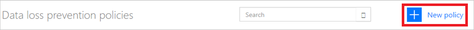

# Directivas de prevención de pérdida de datos (DLP)

Este documento presenta las directivas de prevención de pérdida de datos, que ayudan a proteger los datos de la organización al evitar que se compartan con una lista de conectores que se definen.

## ¿Qué es una directiva de prevención de pérdida de datos?

Los datos de una organización son fundamentales para su éxito. Es preciso que los datos estén disponibles rápidamente para la toma de decisiones, pero deben protegerse para que no se puedan compartir con audiencias que no deberían tener acceso a ellos. Para proteger estos datos, Microsoft Flow ofrece la posibilidad de crear y aplicar directivas que definen qué conectores de consumidor pueden acceder a los datos empresariales y compartirlos. Estas directivas que definen cómo se pueden compartir los datos se conocen como directivas de prevención de pérdida de datos (DLP).

## Razones para crear una directiva de DLP

Una directiva de DLP se crea para definir claramente qué conectores de consumidor pueden acceder a los datos empresariales y compartirlos. Por ejemplo, es posible que una organización que usa Microsoft Flow no quiera que sus datos empresariales de SharePoint se publiquen automáticamente en su fuente de Twitter. Para evitarlo, se crea una directiva de DLP que bloquea el uso de los datos de SharePoint como fuente de tweets.

## Ventajas de una directiva de DLP

* Garantiza que los datos se administran de forma uniforme en toda la organización.
* Evita que los datos empresariales importantes se publiquen accidentalmente en conectores como sitios de redes sociales.

## Administración de directivas de DLP

### Requisitos previos para administrar directivas de DLP

* Permisos de administrador de entornos o administrador de inquilinos.

    Puede obtener más información sobre permisos en el [artículo sobre entornos](environments-overview-admin.md).
* Una [licencia de Microsoft Flow P2](billing-questions.md).

## Creación de una directiva de DLP

### Requisitos previos para crear directivas de DLP

Para crear una directiva de DLP, es preciso tener permisos al menos en un entorno.

Siga estos pasos para crear una directiva de DLP que evite que los datos del sitio de SharePoint de la empresa se publiquen en Twitter:

1. Inicie sesión en el [Centro de administración de Microsoft Flow](https://admin.flow.microsoft.com) (Centro de administración).

1. Seleccione la pestaña Directivas de datos y luego el vínculo **Nueva directiva**:

    
1. Seleccione la pestaña **Grupos de datos**.

1. Escriba el nombre de la directiva de DLP, por ejemplo *Secure Data Access for Contoso*, en la etiqueta **Nombre de la directiva de datos** de la parte superior de la página:

    

1. Seleccione el [entorno](environments-overview-admin.md) en la pestaña **Entornos**.

    > [!NOTE]
    > Como administrador de entorno, puede crear directivas que se apliquen solo a un entorno. Como administrador de inquilinos, puede crear directivas que se apliquen a cualquier combinación de entornos:
    >
    >

    

1. Seleccione la pestaña **Grupos de datos**:

    

1. Seleccione el vínculo **Agregar** que se encuentra dentro del cuadro de grupo **Business data only** (Solo datos profesionales):

    

1. Seleccione los conectores **SharePoint** y **Salesforce** en la página **Agregar conectores**:

   

1. Seleccione el botón **Agregar conectores** para agregar los conectores que pueden compartir datos empresariales.

1. Seleccione **Guardar directiva** en la esquina superior derecha de la pantalla.

1. Transcurridos unos segundos, la nueva directiva de DLP se mostrará en la lista de directivas de prevención de pérdida de datos:

    

1. **Opcional** Envíe un correo electrónico o cualquier otra comunicación a su equipo para avisarle de que hay una nueva directiva de DLP en vigor.

Enhorabuena, ya ha creado una directiva de DLP que permite a la aplicación compartir datos entre SharePoint y Salesforce y que bloquea el uso compartido de datos con cualquier otro servicio.

> [!NOTE]
> Al agregar un servicio a un grupo de datos, automáticamente se quita del otro grupo de datos. Por ejemplo, si actualmente Twitter está en el grupo de datos **business data only** y no desea permitir que los datos empresariales se compartan con Twitter, basta con agregar el servicio Twitter al grupo **no business data allowed**. Esto quitará Twitter desde el grupo de datos "business data only".
>
>

## Infracciones de uso compartido de datos

Si ha creado la directiva de DLP descrita arriba, si un usuario crea un flujo que comparte datos entre Salesforce (que está en el grupo de datos de **solo datos empresariales**) y Twitter (que está en el grupo de datos de **ningún dato empresarial permitido**), se notifica al usuario que el flujo se ha **suspendido** debido a un conflicto con la directiva de prevención de pérdida de datos creada.

Si los usuarios se ponen en contacto con usted acerca de flujos suspendidos, aquí hay algunas cosas a tener en cuenta:

1. En este ejemplo, si hay una razón empresarial válida para compartir datos empresariales entre SharePoint y Twitter, puede editar la directiva de DLP.

1. Pida al usuario que modifique el flujo para cumplir con la directiva DLP.

1. Pida al usuario que deje el flujo en estado suspendido hasta que se tome una decisión sobre el uso compartido de datos entre estas dos entidades.

## Búsqueda de una directiva de DLP

### Administradores

Los administradores pueden utilizar la característica de búsqueda del Centro de administración para buscar directivas de DLP concretas.

> [!NOTE]
> Los administradores deben publicar todas las directivas de DLP para que los usuarios de la organización las conozcan antes de crear flujos.
>
>

### Creadores

Si no tiene permisos de administrador y desea más información acerca de las directivas de DLP de su organización, póngase en contacto con el administrador de la misma. También puede obtener más información en el [artículo sobre entornos de creadores](environments-overview-maker.md).

> [!NOTE]
> Los administradores son los únicos que pueden editar o eliminar directivas de DLP.
>
>

## Edición de una directiva de DLP

1. Inicie el [Centro de administración](https://admin.flow.microsoft.com).

1. Seleccione el vínculo **Data polices** (Directivas de datos) en el lado izquierdo.

    

1. Busque en la lista de directivas de DLP existentes y seleccione el botón de edición que aparece junto a la directiva que quiere editar.

1. Realice los cambios necesarios en la directiva. Puede modificar el entorno o los servicios de los grupos de datos, por ejemplo.

1. Seleccione **Guardar directiva** para guardar los cambios.

> [!NOTE]
> Los administradores de entorno pueden ver las directivas de DLP creadas por los administradores de inquilinos, pero no pueden editarlas.
>
>

## Eliminación de una directiva de DLP

1. Inicie el [Centro de administración](https://admin.flow.microsoft.com).

1. Seleccione la pestaña **Directivas de datos** en el lado izquierdo.

    

1. Busque en la lista de directivas de DLP existentes y luego seleccione el botón de eliminación que aparece junto a la directiva que quiere eliminar:

    

1. Confirme que realmente desea eliminar la directiva, para lo que debe seleccionar el botón **Eliminar**:

    

## Permisos de la directiva de DLP

Las directivas de DLP solo pueden crearlas y modificarlas los administradores de inquilinos y de entornos. Puede obtener más información sobre permisos en el artículo sobre [entornos](environments-overview-admin.md).

## Pasos siguientes

* [Más información acerca de los entornos](environments-overview-admin.md)
* [Más información acerca de Microsoft Flow](getting-started.md)
* [Más información acerca del Centro de administración](admin-center-introduction.md)
* [Más información sobre la integración de datos](https://docs.microsoft.com/common-data-service/entity-reference/dynamics-365-integration)
