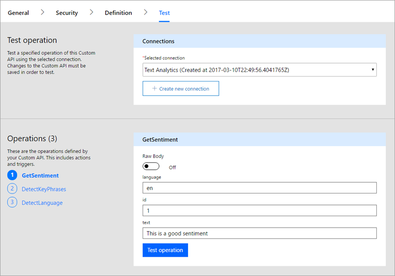

# <a name="register-and-use-custom-connectors-in-microsoft-flow"></a>Registro y uso de conectores personalizados en Microsoft Flow
Microsoft Flow le permite compilar flujos de trabajo sin ningún código. Pero, en algunos casos, necesitará ampliar las funcionalidades de Microsoft Flow y los servicios web son la solución más adecuada. El flujo puede conectarse a un servicio, realizar operaciones y obtener datos. Si tiene un servicio web al que desea conectarse con Microsoft Flow, debe registrar el servicio como un conector personalizado. Este proceso permite a Microsoft Flow comprender las características de su API de web, incluida la autenticación que requiere, las acciones que admite y los parámetros y salidas de cada una de esas acciones.

En este tema, se describirán los pasos necesarios para registrar y utilizar un conector personalizado y se usará la [Text Analytics API](https://www.microsoft.com/cognitive-services/text-analytics-api) de Azure Cognitive Services. Esta API identifica el idioma, las opiniones y las frases clave del texto que se le pasa.

## <a name="prerequisites"></a>Requisitos previos
* Una [cuenta de Microsoft Flow](https://flow.microsoft.com).
* Un archivo de OpenAPI 2.0 (anteriormente conocido como Swagger) en formato JSON, una dirección URL a una definición de OpenAPI o una colección de Postman para su API. Si no dispone de alguno de estos, le ofreceremos algunos consejos.
* Una imagen para usar como icono del conector personalizado (opcional).

## <a name="steps-in-the-custom-connector-process"></a>Pasos del proceso de registro del conector personalizado
El proceso de registro del conector personalizado tiene varios pasos, que se describen brevemente a continuación. En este artículo se da por supuesto que ya tiene una API de RESTful con algún tipo de acceso autenticado, por lo que nos centraremos en los pasos 3 a 6 durante el resto del artículo. Para ver un ejemplo de los pasos 1 y 2, consulte [Creación de una Web API personalizada para Microsoft Flow](customapi-web-api-tutorial.md).

1. **Compile una API de RESTful** en el lenguaje y plataforma que prefiera. Para las tecnologías de Microsoft, se recomienda utilizar alguna de las siguientes (aunque puede usar cualquiera):
   
   * Azure Functions
   * Azure Web Apps
   * Azure API Apps
2. **Proteja la API** mediante uno de los siguientes mecanismos de autenticación. Puede permitir el acceso no autenticado a los conectores, pero no es aconsejable.
   
   * Azure Active Directory. Para más información, consulte [Uso de Azure Active Directory con un conector personalizado en Microsoft Flow](customapi-azure-resource-manager-tutorial.md)
   * OAuth 2.0 para servicios específicos como Dropbox, Facebook y SalesForce
   * OAuth 2.0 genérica.
   * Clave de API
   * Autenticación básica
3. **Describa la API** de una de las dos maneras estándar del sector, para que Microsoft Flow pueda conectarse a ella.
   
   * Un archivo OpenAPI
   * Una colección Postman
     
     También puede compilar un archivo OpenAPI en el paso 4 como parte del proceso de registro.
4. **Registre el conector personalizado** mediante un asistente en Microsoft Flow, donde especifique una descripción, detalles de seguridad y otra información sobre la API.
5. **Use el conector personalizado** en una aplicación. Cree una conexión al conector en la aplicación y llame a cualquiera de las operaciones que proporciona la API de la misma manera que llama a las conexiones estándar en Microsoft Flow.
6. **Comparta el conector personalizado** como hace con otros recursos de Microsoft Flow. Este paso es opcional pero, a menudo, es aconsejable compartir conectores personalizados entre varios creadores de aplicaciones.

## <a name="describe-your-api"></a>Descripción de la API
En el supuesto de que disponga de una API con algún tipo de acceso autenticado, necesita una manera de describir la API para que Microsoft Flow pueda conectarse a esta. Para ello, cree un archivo OpenAPI o una colección Postman. Puede hacerlo desde *cualquier* punto de conexión de la API de REST incluidos:

* Los conectores disponibles públicamente. Entre estas se incluyen [Spotify](https://developer.spotify.com/), [Uber](https://developer.uber.com/), [Slack](https://api.slack.com/), [Rackspace](http://docs.rackspace.com/) y muchas más.
* Una API creada e implementada en cualquier proveedor de hospedaje en la nube, como Azure, Amazon Web Services (AWS), Heroku, Google Cloud, etc.
* Una API personalizada de línea de negocio implementada en su red, siempre que la API esté disponible públicamente en Internet.

OpenAPI 2.0 (anteriormente conocido como Swagger) y las colecciones Postman usan formatos diferentes, pero todos son documentos que la máquina puede leer escritos en distintos lenguajes que describen las operaciones y los parámetros de la API:

* Puede generar estos documentos con diversas herramientas según el idioma y la plataforma en la que esté compilada la API. Consulte la [documentación sobre Text Analytics API](https://westus.dev.cognitive.microsoft.com/docs/services/TextAnalytics.V2.0/export?DocumentFormat=Swagger&ApiName=Azure) para obtener un ejemplo de un archivo OpenAPI.
* Si aún no tiene ningún archivo OpenAPI y no desea crearlo, puede crear fácilmente un conector personalizado mediante una colección Postman. Consulte [Creación de una colección Postman](postman-collection.md) para más información.
* Microsoft Flow usa en última instancia OpenAPI en segundo plano, por lo que una colección Postman se puede analizar y traducir en un archivo de definición de OpenAPI.

**Nota**: el tamaño del archivo debe ser inferior a 1 MB.

### <a name="getting-started-with-openapi-and-postman"></a>Introducción a OpenAPI y Postman
* Si no está familiarizado con OpenAPI, consulte la [Introducción a OpenAPI](http://swagger.io/getting-started/) en el sitio swagger.io.
* Si no está familiarizado con Postman, instale la [aplicación Postman](https://www.getpostman.com/apps) desde el sitio web de esta.
* Si la API está compilada con Azure API Apps o Azure Functions, consulte [Exportación de una API de Azure hospedada en PowerApps y Microsoft Flow](https://docs.microsoft.com/azure/app-service/app-service-export-api-to-powerapps-and-flow) para más información.

## <a name="register-your-custom-connector"></a>Registro del conector personalizado
Ahora usará el archivo OpenAPI o la colección Postman para registrar el conector personalizado en Microsoft Flow.

1. En [flow.microsoft.com](https://flow.microsoft.com), en la barra superior, seleccione el icono de engranaje para abrir el menú de configuración. Seleccione la opción **Conectores personalizados**.
   
      
2. Seleccione **Crear conector personalizado**.
   
    
3. En la pestaña **General**, elija cómo desea crear el conector personalizado.
   
   * Con la carga de un archivo OpenAPI
   * Pegando una dirección URL de OpenAPI
   * Con la carga de Postman Collection V1
     
     
     
     Cargue un icono para el conector personalizado. Los campos Descripción, Host y URL Base normalmente se rellenan automáticamente con la información del archivo OpenAPI. Si no es así, puede agregar la información a esos campos. Seleccione **Continuar**.
4. En la pestaña **Seguridad**, especifique todas las propiedades de autenticación.
   
    
   
   * El tipo de autenticación se rellena automáticamente en función de lo que se haya definido en el objeto `securityDefinitions` de OpenAPI. A continuación se muestra un ejemplo de OAuth2.0.
     
       ```
       "securityDefinitions": {
           "AAD": {
           "type": "oauth2",
           "flow": "accessCode",
           "authorizationUrl": "https://login.windows.net/common/oauth2/authorize",
           "tokenUrl": "https://login.windows.net/common/oauth2/token"
           "scopes": {}
           }
       },
       ```
   * Si el archivo OpenAPI no usa el objeto `securityDefintions`, no será necesario especificar valores adicionales.
   * Si se usa una colección Postman, el tipo de autenticación se rellena automáticamente solo cuando se usan tipos de autenticación admitidos como, por ejemplo, OAuth 2.0 o Basic.
   * Para obtener un ejemplo de cómo configurar la autenticación de Azure Active Directory (AAD), consulte [Creación de una Web API personalizada para Microsoft Flow](customapi-web-api-tutorial.md#set-up-azure-active-directory-authentication).
5. En la pestaña **Definiciones**, todas las operaciones definidas en el archivo OpenAPI o en la colección de Postman, junto con los valores de solicitud y respuesta, se rellenan automáticamente. Si se han definido todas las operaciones necesarias, puede ir al paso 6 del proceso de registro sin realizar cambios en esta pantalla.
   
    
   
    Si desea editar acciones existentes o agregar nuevas acciones al conector personalizado, siga leyendo lo que sigue a continuación.
   
   1. Si desea agregar una nueva acción que no se encontraba en el archivo OpenAPI o la colección Postman, seleccione **Nueva acción** en el panel izquierdo y rellene la sección **General** con el nombre, la descripción y la visibilidad de la operación.
   2. En la sección **Solicitud**, seleccione **Importar desde ejemplo** en la parte superior derecha. En el formulario de la derecha, pegue una solicitud de ejemplo. Las solicitudes de ejemplo normalmente están disponibles en la documentación de la API. Allí podrá obtener información para rellenar los campos **Verbo**, **URL de solicitud**, **Encabezados** y **Cuerpo**. Consulte la [documentación sobre Text Analytics API](https://westus.dev.cognitive.microsoft.com/docs/services/TextAnalytics.V2.0/operations/56f30ceeeda5650db055a3c6) para obtener un ejemplo.
      
      > [!IMPORTANT]
      > Asegúrese de que quita el encabezado `Content-type` de las acciones, ya que lo agregará automáticamente Microsoft Flow. Los encabezados de autenticación que se han definido en la sección **Seguridad** también deben quitarse de las acciones y los desencadenadores. 
      > 
      > 
      
      
   3. Seleccione **Importar** para completar la definición de la solicitud. Defina la respuesta de una manera similar.
6. Una vez que tenga todas las operaciones definidas, seleccione **Crear** para crear el conector personalizado.
7. Una vez que haya creado el conector personalizado, vaya a la pestaña **Probar** para probar las operaciones definidas en la API. Elija una conexión y proporcione parámetros de entrada para probar una operación.
   
    
   
    Si la llamada se realiza correctamente, obtendrá una respuesta válida.
   
    

### <a name="quota-and-throttling"></a>Cuota y limitación
* Consulte la página sobre [precios de Microsoft Flow](https://flow.microsoft.com/pricing/) para más información acerca de las cuotas de creación del conector personalizado. Los conectores personalizados que se comparten con usted no cuentan para esta cuota.
* Para cada conexión creada en un conector personalizado, los usuarios pueden realizar hasta 500 solicitudes por minuto.

## <a name="share-your-custom-connector"></a>Uso compartido del conector personalizado
Ahora que tiene un conector personalizado, puede compartirlo con otros usuarios de la organización. Tenga en cuenta que cuando comparte un conector personalizado, otros usuarios pueden empezar a depender de él, y que al eliminar un conector personalizado se eliminarán todas las conexiones al conector. Si desea proporcionar un conector para usuarios ajenos a su organización, consulte [Overview of certifying custom connectors in Microsoft Flow](api-connector-overview.md) (Introducción a la certificación de conectores personalizados en Microsoft Flow).

1. En [flow.microsoft.com](https://flow.microsoft.com), en la barra superior, seleccione el icono de engranaje para abrir el menú de configuración. Seleccione la opción **Conectores personalizados**.
   
    
2. Seleccione el botón de puntos suspensivos (**...**) del conector y, a continuación, seleccione **Ver propiedades**.  
   
    
3. Seleccione **Compartir**y, a continuación, especifique los usuarios o grupos a los que desea conceder acceso al conector.  
   
    
4. Seleccione **Guardar**.

## <a name="next-steps"></a>Pasos siguientes
[Aprenda a crear una colección Postman](postman-collection.md)

[Aprenda a crear extensiones personalizadas de OpenAPI](customapi-how-to-swagger.md).

[Use una ASP.NET Web API](customapi-web-api-tutorial.md).

[Registro de una API de Azure Resource Manager](customapi-azure-resource-manager-tutorial.md).

