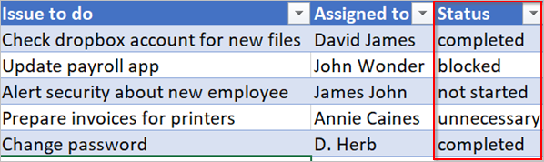

# <a name="use-expressions-in-conditions-to-check-multiple-values"></a>Usar expresiones en condiciones para comprobar varios valores
[!INCLUDE [view-pending-approvals](includes/cc-rebrand.md)]
En este tutorial, aprenderá a usar expresiones y **condiciones** para comparar varios valores en **modo avanzado**.

Al crear un flujo, puede usar la tarjeta [**condición**](add-condition.md#add-a-condition) en modo básico para comparar rápidamente un valor único con otro valor. Sin embargo, hay ocasiones en las que es necesario comparar varios valores. Por ejemplo, puede que desee comprobar el valor de algunas columnas en una hoja de cálculo o una tabla de base de datos.

Puede usar cualquier combinación de las siguientes expresiones lógicas en sus condiciones.

Expresiones|Denominación|Ejemplo
--------|-----------|-------
|[etc](#use-the-and-expression)|Toma dos argumentos y devuelve true si ambos valores son true.<br><b>Nota</b>: ambos argumentos deben ser booleanos.|Esta expresión devuelve false: <br>y (mayor (1,1), es igual a (0,0))
|[de](#use-the-or-expression)|Toma dos argumentos y devuelve true si alguno de los argumentos es true. <br><b>Nota</b>: ambos argumentos deben ser booleanos.|Esta expresión devuelve true:<br>o (mayor (1,1), es igual a (0,0))
|es igual a|Devuelve true si dos valores son iguales.|Por ejemplo, si parámetro1 es someValue, esta expresión devuelve true:<br>es igual a (parámetros (' parámetro1 '), ' someValue ')
|[sea](#use-the-less-expression)|Toma dos argumentos y devuelve true si el primer argumento es menor que el segundo argumento. <br><b>Nota</b>: los tipos admitidos son Integer, float y String.|Esta expresión devuelve true:<br>menos (10100)
|lessOrEquals|Toma dos argumentos y devuelve true si el primer argumento es menor o igual que el segundo argumento. <br><b>Nota</b>: los tipos admitidos son Integer, float y String.|Esta expresión devuelve true:<br>lessOrEquals (10, 10)
|[menor](#use-the-greater-expression)|Toma dos argumentos y devuelve true si el primer argumento es mayor que el segundo argumento. <br><b>Nota</b>: los tipos admitidos son Integer, float y String.|Esta expresión devuelve false:<br>mayor (10, 10)
|greaterOrEquals|Toma dos argumentos y devuelve true si el primer argumento es mayor o igual que el segundo argumento. <br><b>Nota</b>: los tipos admitidos son Integer, float y String.|Esta expresión devuelve false:<br>greaterOrEquals (10100)
|[vacía](#use-the-empty-expression)|Devuelve true si el objeto, matriz o cadena están vacíos.|Esta expresión devuelve true:<br>vacío (' ')
|tampoco|Devuelve el contrario de un valor booleano. |Esta expresión devuelve true:<br>not (Contains (' 200 Success ', ' FAIL '))
|Cuando|Devuelve un valor específico si la expresión da como resultado true o false.|Esta expresión devuelve "Yes":<br>Si (es igual a (1,1), "sí", "no")

## <a name="prerequisites"></a>Requisitos previos
* Acceso a Microsoft Flow.
* Una hoja de cálculo con las tablas descritas más adelante en este tutorial. Asegúrese de guardar la hoja de cálculo en una ubicación como Dropbox o Microsoft OneDrive para que Microsoft Flow pueda acceder a ella.
* Microsoft Office 365 Outlook (aunque usamos Office 365 Outlook, puede usar cualquier servicio de correo electrónico compatible en sus flujos).

## <a name="use-the-or-expression"></a>Usar la expresión o
A veces, el flujo de trabajo debe realizar una acción si el valor de un elemento es valueA **o** valueB. Por ejemplo, puede que esté realizando un seguimiento del estado de las tareas en una tabla de hoja de cálculo. Suponga que la tabla tiene una columna denominada *status* y que los valores posibles de la columna *Estado* son:

* **cubiertos**
* **bloqueo**
* **inútil**
* **no iniciado**

Este es un ejemplo del aspecto que podría tener la hoja de cálculo:



Dada la hoja de cálculo anterior, desea usar Microsoft Flow para quitar todas las filas con una columna de *Estado* establecida en *completado* o *innecesaria*.

Vamos a crear el flujo.

### <a name="start-with-a-blank-flow"></a>Comenzar con un flujo en blanco
1. Inicie sesión en [Microsoft Flow](https://flow.microsoft.com).

    
2. Seleccione la pestaña **Mis flujos** .

    
3. Seleccione **crear desde**cero.

    

### <a name="add-a-trigger-to-your-flow"></a>Incorporación de un desencadenador al flujo
1. Busque **programación**y, a continuación, seleccione el desencadenador **programación-periodicidad** .

    
2. Establezca la programación para que se ejecute una vez al día.

    

### <a name="select-the-spreadsheet-and-get-all-rows"></a>Seleccionar la hoja de cálculo y obtener todas las filas
1. Seleccione **nuevo paso** > **Agregar una acción**.

    
2. Busque **filas**y, a continuación, seleccione **Excel-obtener filas**.

    Nota: seleccione la acción "obtener filas" que se corresponda con la hoja de cálculo que esté usando. Por ejemplo, si está usando hojas de Google, seleccione **hojas de Google-obtener filas**.

    
3. Seleccione el icono de carpeta en el cuadro **nombre de archivo** , busque y, a continuación, seleccione la hoja de cálculo que contiene los datos.

    
4. Seleccione la tabla que contiene los datos de la lista **nombre de tabla** .

    

### <a name="check-the-status-column-of-each-row"></a>Comprobar la columna Estado de cada fila
1. Seleccione **nuevo paso** > **más** > **Agregar una aplicación a cada**.

    
2. Agregue el token de **valor** al cuadro **Seleccione una salida de los pasos anteriores** .

    
3. Seleccione **Agregar una condición** > **Editar en modo avanzado**.
4. Agregue la siguiente expresión **or** . Esta expresión **or** comprueba el valor de cada fila de la tabla (una fila se conoce como un elemento cuando se tiene acceso a ella en una expresión). Si el valor de la columna **status** es *completed* **o** *innecesario*, la expresión **o** se evalúa como "true".

    La expresión **or** aparece como se muestra aquí:

    ````@or(equals(item()?['status'], 'unnecessary'), equals(item()?['status'], 'completed'))````

    La tarjeta de **condición** es similar a esta imagen:

    

### <a name="delete-matching-rows-from-the-spreadsheet"></a>Eliminar filas coincidentes de la hoja de cálculo
1. Seleccione **Agregar una acción** en la rama en **caso afirmativo, no hacer nada** de la condición.
2. Busque **Eliminar fila**y, después, seleccione **Excel-eliminar fila**.

    
3. En el cuadro **nombre de archivo** , busque y seleccione el archivo de hoja de cálculo que contiene los datos que desea eliminar.
4. En la lista **nombre de tabla** , seleccione la tabla que contiene los datos.
5. Coloque el token de ID. de **fila** en el cuadro ID. de **fila** .

    

### <a name="name-the-flow-and-save-it"></a>Asigne un nombre al flujo y guárdelo
1. Asigne un nombre al flujo y, a continuación, seleccione el botón **Crear flujo** .

    

### <a name="run-the-flow-with-the-or-expression"></a>Ejecución del flujo con la expresión o
El flujo se ejecuta después de guardarlo. Si ha creado la hoja de cálculo que se mostró anteriormente en este tutorial, este es el aspecto que tendrá una vez completada la ejecución:


Observe que se han eliminado todos los datos de las filas que tenían "completado" o "innecesario" en la columna Estado.

## <a name="use-the-and-expression"></a>Usar la expresión and
Supongamos que tiene una tabla de hojas de cálculo con dos columnas. Los nombres de columna tienen el estado y están asignados. Supongamos también que desea eliminar todas las filas si el valor de la columna de estado es "bloqueado" y el valor de la columna asignada es "John Wonder".  Para realizar esta tarea, siga todos los pasos descritos anteriormente en este tutorial; sin embargo, cuando edite la tarjeta **condición** en modo avanzado, use la expresión **y** que se muestra aquí:

````@and(equals(item()?['Status'], 'blocked'), equals(item()?['Assigned'], 'John Wonder'))````

La tarjeta de **condición** es similar a esta imagen:


### <a name="run-the-flow-with-the-and-expression"></a>Ejecución del flujo con la expresión and
Si ha seguido estos pasos, la hoja de cálculo es similar a la de esta imagen:


Una vez que se ejecuta el flujo, la hoja de cálculo es similar a esta imagen:


## <a name="use-the-empty-expression"></a>Usar la expresión vacía
Observe que ahora hay varias filas vacías en la hoja de cálculo. Para quitarlos, utilice la expresión **vacía** para identificar todas las filas que no tengan texto en las columnas asignado y status.

Para realizar esta tarea, siga todos los pasos indicados en **la sección uso de la expresión y** anteriormente en este tutorial, sin embargo, cuando edite la tarjeta **condición** en modo avanzado, use la expresión vacía de esta manera:

````@and(empty(item()?['Status']), empty(item()?['Assigned']))````

La tarjeta de **condición** es similar a esta imagen:


Una vez que se ejecuta el flujo, la hoja de cálculo es similar a esta imagen:


Observe que las líneas adicionales se quitan de la tabla.

## <a name="use-the-greater-expression"></a>Usar la expresión mayor
Imagine que ha comprado vales de béisbol para sus compañeros de trabajo y está usando una hoja de cálculo para asegurarse de que se le reembolsa cada persona. Puede crear rápidamente un flujo que envíe un correo electrónico diario a cada persona que no haya pagado el importe completo.

Use la expresión **mayor** para identificar los empleados que no hayan pagado la cantidad completa. Después, puede enviar automáticamente un correo electrónico de recordatorio descriptivo a aquellos que no hayan pagado por completo.

Esta es una vista de la hoja de cálculo:


A continuación se muestra la implementación de la expresión **mayor** que identifica a todas las personas que han pagado menos que la cantidad debida a las mismas:

````@greater(item()?['Due'], item()?['Paid'])````

## <a name="use-the-less-expression"></a>Usar la expresión less
Imagine que ha comprado vales de béisbol para sus compañeros de trabajo y que usa una hoja de cálculo para asegurarse de que se le reembolsa cada persona en función de la fecha en la que se haya acordado todo el mundo. Puede crear un flujo que envíe un recordatorio por correo electrónico a cada persona que no haya pagado el importe completo si la fecha actual es inferior a un día anterior a la fecha de vencimiento.

Use la expresión **y** junto con la expresión **less** , ya que se están validando dos condiciones:


|          Condición para validar          | expresión que se va a usar |                    Ejemplo                     |
|-----------------------------------------|-------------------|------------------------------------------------|
|   ¿Se ha pagado el importe total debido?    |      menor      |   @greater(elemento ()? [' Debido a '], elemento ()? [' Pagado '])    |
| ¿La fecha de vencimiento es inferior a un día? |       sea        | @less(elemento ()? [' DueDate '], addDays (utcNow (), 1)) |

## <a name="combine-the-greater-and-less-expressions-in-an-and-expression"></a>Combinar las expresiones mayor y menor en una expresión and
Use la expresión **mayor** para identificar a los empleados que han pagado menos que la cantidad total adeudada y use la expresión **less** para determinar si la fecha de vencimiento del pago es inferior a un día de la fecha actual. Después, puede enviar **una acción enviar un correo electrónico** para enviar un correo electrónico de recordatorio descriptivo a aquellos que no hayan pagado por completo y que la fecha de vencimiento sea inferior a un día.

Esta es una vista de la tabla de la hoja de cálculo:


Esta es la implementación de la expresión **y** que identifica a todas las personas que han pagado menos que la cantidad debida a ellas y que la fecha de vencimiento es inferior a un día de la fecha actual:

````@and(greater(item()?['Due'], item()?['Paid']), less(item()?['dueDate'], addDays(utcNow(),1)))````

## <a name="use-functions-in-expressions"></a>Usar funciones en expresiones

Algunas expresiones obtienen sus valores de acciones en tiempo de ejecución que podrían no existir cuando se inicia la ejecución de un flujo. Para hacer referencia o trabajar con estos valores en las expresiones, puede usar las funciones que proporciona el lenguaje de definición de flujo de trabajo. Más información: [referencia de funciones para el lenguaje de definición de flujo de trabajo en Microsoft Flow](https://docs.microsoft.com/azure/logic-apps/workflow-definition-language-functions-reference)
