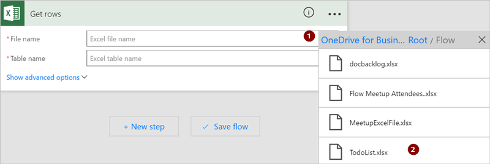
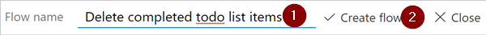
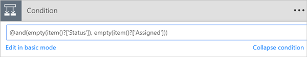

# <a name="use-functions-in-conditions-to-check-multiple-values"></a>Uso de funciones en condiciones para comprobar varios valores
En este tutorial, aprenderá a utilizar las funciones y **condiciones** para comparar varios valores en **modo avanzado**.

Cuando se crea un flujo, puede usar la tarjeta [**Condición**](add-a-condition.md#add-a-condition) en modo básico para comparar rápidamente un valor individual con otro. Sin embargo, hay veces en las que necesita comparar varios valores. Por ejemplo, puede comprobar el valor de varias columnas de una hoja de cálculo o de una tabla de base de datos.

Puede usar cualquier combinación de las siguientes funciones lógicas en las condiciones.

| Función | Descripción | Ejemplo |
| --- | --- | --- |
| <a href="#use-the-and-function">and</a> |Toma dos argumentos y devuelve true si ambos valores son true.<br><b>Nota</b>: ambos argumentos deben ser valores booleanos. |Esta función devuelve false: <br>and(greater(1,10),equals(0,0)) |
| <a href="#use-the-or-function">or</a> |Toma dos argumentos y devuelve true si cualquiera de los dos argumentos es true. <br><b>Nota</b>: ambos argumentos deben ser valores booleanos. |Esta función devuelve true:<br>or(greater(1,10),equals(0,0)) |
| equals |Devuelve true si los dos valores son iguales. |Por ejemplo, si el valor de parameter1 es someValue, esta función devuelve true:<br>equals(parameters('parameter1'), 'someValue') |
| <a href="#use-the-less-function">less</a> |Toma dos argumentos y devuelve true si el primer argumento es menor que el segundo. <br><b>Nota</b>: los tipos admitidos son integer, float y string. |Esta función devuelve true:<br>less(10,100) |
| lessOrEquals |Toma dos argumentos y devuelve true si el primer argumento es menor o igual que el segundo. <br><b>Nota</b>: los tipos admitidos son integer, float y string. |Esta función devuelve true:<br>lessOrEquals(10,10) |
| <a href="#use-the-greater-function">greater</a> |Toma dos argumentos y devuelve true si el primer argumento es mayor que el segundo. <br><b>Nota</b>: los tipos admitidos son integer, float y string. |Esta función devuelve false:<br>greater(10,10) |
| greaterOrEquals |Toma dos argumentos y devuelve true si el primer argumento es mayor o igual que el segundo. <br><b>Nota</b>: los tipos admitidos son integer, float y string. |Esta función devuelve false:<br>greaterOrEquals(10,100) |
| <a href="#use-the-empty-function">empty</a> |Devuelve true si el objeto, matriz o cadena están vacíos. |Esta función devuelve true:<br>empty('') |
| not |Toma dos argumentos y devuelve true si los argumentos son false. <br><b>Nota</b>: ambos argumentos deben ser valores booleanos. |Esta función devuelve true:<br>not(contains('200 Success','Fail')) |
| if |Devuelve un valor específico si el resultado de la expresión es true o false. |Esta función devuelve "yes":<br>if(equals(1, 1), 'yes', 'no') |

## <a name="prerequisites"></a>Requisitos previos
* Acceso a Microsoft Flow.
* Una hoja de cálculo con las tablas que se describirán más adelante en este tutorial. Asegúrese de guardar la hoja de cálculo en una ubicación como Dropbox o Microsoft OneDrive para que Microsoft Flow pueda acceder a ella.
* Microsoft Office 365 Outlook (aunque aquí se usa Office 365 Outlook, se puede utilizar cualquier servicio de correo electrónico compatible en los flujos).

## <a name="use-the-or-function"></a>Uso de la función or
En ocasiones un flujo de trabajo debe realizar una acción si el valor de un elemento es valueA **o** valueB. Por ejemplo, puede hacer un seguimiento del estado de las tareas de una tabla de una hoja de cálculo. Suponga que la tabla tiene una columna denominada *Status*, cuyos valores posibles son:

* **completed**
* **blocked**
* **unnecessary**
* **not started**

A continuación se muestra un ejemplo del aspecto que podría tener la hoja de cálculo:


Dada la hoja de cálculo anterior, es posible que desea usar Microsoft Flow para quitar todas las filas con una columna *Status* que se establece en *completed* o *unnecesary*.

Vamos a crear el flujo.

### <a name="start-with-a-blank-flow"></a>Comience con un flujo en blanco
1. Inicie sesión en [Microsoft Flow](https://flow.microsoft.com).
   
    
2. Seleccione la pestaña **Mis flujos**.
   
    
3. Seleccione **Crear desde cero**.
   
    

### <a name="add-a-trigger-to-your-flow"></a>Agregue un desencadenador al flujo
1. Busque **Programación** y seleccione el desencadenador **Programación - Periodicidad**
   
    
2. Configure la programación para que se ejecute una vez al día.
   
    

### <a name="select-the-spreadsheet-and-get-all-rows"></a>Seleccione la hoja de cálculo y obtenga todas las filas
1. Seleccione **Nuevo paso** > **Agregar una acción**.
   
    
2. Busque **filas** y seleccione **Excel - 
Obtener filas**.
   
    Nota: Seleccione la acción "obtener filas" que corresponda a la hoja de cálculo que vaya a usar. Por ejemplo, si va a utilizar Hojas de cálculo de Google, seleccione **Hojas de cálculo de Google - Obtener filas**.
   
    
3. Seleccione el icono de la carpeta en el cuadro **Nombre de archivo**, busque la hoja de cálculo que contiene los datos y selecciónela.
   
    
4. Seleccione la tabla que contiene los datos en la lista **Nombre de tabla**.
   
    

### <a name="check-the-status-column-of-each-row"></a>Compruebe la columna de estado de cada fila
1. Seleccione **Nuevo paso** > **Más** > **Agregar Aplicar a cada uno**.
   
    
2. Agregue el token **Valor** al cuadro **Seleccionar una salida de los pasos**.
   
    
3. Seleccione **Agregar una condición** > **Editar en el modo avanzado**.
4. Agregue la siguiente función **or**. Esta función **or** comprueba el valor de cada fila de la tabla (una fila se conoce como un elemento cuando se accede en una función). Si el valor de la columna **status** es *completed* **o** *unnecesary*, la función **or** se evalúa como "true".
   
    La función **or** aparece como se muestra aquí:
   
    ````@or(equals(item()?['status'], 'unnecessary'), equals(item()?['status'], 'completed'))````
   
    La tarjeta **Condición** es como la que aparece en esta imagen:
   
    

### <a name="delete-matching-rows-from-the-spreadsheet"></a>Eliminación de las filas coincidentes de la hoja de cálculo
1. Seleccione **Agregar una acción** en la sección **IF YES, DO NOTHING** (En caso positivo, no hacer nada) de la condición.
2. Busque **Eliminar fila**y, después, seleccione **Excel - Eliminar fila**.
   
    
3. En el cuadro  **Nombre de archivo**, busque y seleccione el archivo de la hoja de cálculo que contiene los datos que desea eliminar.
4. En la lista **Nombre de tabla**, seleccione la tabla que contiene los datos.
5. Coloque el token **Id. de fila** en el cuadro **Id. de fila**.
   
    

### <a name="name-the-flow-and-save-it"></a>Asigne un nombre al flujo y guárdelo
1. Asigne un nombre al flujo y haga clic en el botón **Crear flujo**.
   
    

### <a name="run-the-flow-with-the-or-function"></a>Ejecución del flujo con la función or
El flujo se ejecuta después de que se guarda. Si ha creado la hoja de cálculo que se ha mostrado anteriormente en el tutorial, así debería ser una vez que se complete la ejecución:


Observe que se han eliminado todos los datos de las filas en los que aparece "completed" o "unnecessary" en la columna Status.

## <a name="use-the-and-function"></a>Uso de la función and
Suponga que tiene una tabla de hoja de cálculo con dos columnas, cuyos nombres son Status y Assigned. Suponga también que desea eliminar todas las filas si el valor de la columna Status es "blocked" y el valor de la columna Assigned es "John Wonder".  Para realizar esta tarea, siga todos los pasos indicados anteriormente en este tutorial, pero cuando edite la tarjeta **Condición** en modo avanzado, use la función **and** que se muestra aquí:

````@and(equals(item()?['Status'], 'blocked'), equals(item()?['Assigned'], 'John Wonder'))````

La tarjeta **Condición** es como la que aparece en esta imagen:


### <a name="run-the-flow-with-the-and-function"></a>Ejecución del flujo con la función and
Si ha seguido todos los pasos, la hoja de cálculo se parecerá a la de la siguiente imagen:


Después de la ejecución del flujo, la hoja de cálculo es similar a la de esta imagen:


## <a name="use-the-empty-function"></a>Uso de la función empty
Observe que ahora hay varias filas vacías en la hoja de cálculo. Para quitarlas, utilice la función **empty** para identificar todas las filas que no tengan texto en las columnas Assigned y Status.

Para realizar esta tarea, siga todos los pasos indicados en la sección **Uso de la función and** de este tutorial, sin embargo, cuando edite la tarjeta **Condición** en modo avanzado, use la función empty como se muestra a continuación:

````@and(empty(item()?['Status']), empty(item()?['Assigned']))````

La tarjeta **Condición** es como la que aparece en esta imagen:



Después de la ejecución del flujo, la hoja de cálculo es similar a la de esta imagen:


Tenga en cuenta que las líneas adicionales se quitan de la tabla.

## <a name="use-the-greater-function"></a>Uso de la función greater
Imagine que ha comprado entradas para un partido de béisbol para sus compañeros de trabajo y que usa una hoja de cálculo para asegurarse de que todos se las pagan. Puede crear rápidamente un flujo que envíe un correo electrónico diario a cada persona que no haya pagado la cantidad total.

Use la función **greater** para identificar los empleados que no hayan pagado la cantidad total. Posteriormente, puede enviar automáticamente un recordatorio amistoso por correo electrónico a quienes no hayan pagado la totalidad.

Esta es una vista de la hoja de cálculo:


Esta es la implementación de la función **greater** que identifica a todas las personas que han pagado menos de lo que deben:

````@greater(item()?['Due'], item()?['Paid'])````

## <a name="use-the-less-function"></a>Uso de la función less
Suponga que ha comprado entradas para un partido de béisbol para sus compañeros de trabajo y que usa una hoja de cálculo para asegurarse de que todos se las pagan antes de la fecha acordada. Puede crear un flujo que envíe un recordatorio por correo electrónico a todos aquellos que no hayan pagado el importe íntegro si la fecha actual es menos de un día antes de la fecha de vencimiento.

Use la función **and** junto con la función **less**, ya que se validan dos condiciones:

| Condición que se valida | Función que se utiliza | Ejemplo |
| --- | --- | --- |
| ¿Se ha pagado el importe total que se debe? |greater |@greater(item()?['Due'], item()?['Paid']) |
| ¿Es el fecha de vencimiento inferior a un día? |less |@less(item()?['DueDate'], addDays(utcNow(),1)) |

## <a name="combine-the-greater-and-less-functions-in-an-and-function"></a>Combinación de las funciones greater y less en una función and
Utilice la función **greater** para identificar a los empleados que han pagado menos que la cantidad total que se debe y la función **less** para determinar si la fecha de vencimiento del pago sea inferior a un día desde la fecha actual. Luego puede usar la acción **Enviar un correo electrónico** para enviar un recordatorio amistoso por correo electrónico a aquellos que no hayan pagado la totalidad cuando la fecha de vencimiento sea inferior a un día.

Esta es una vista de la tabla de la hoja de cálculo:


Esta es la implementación de la función **and** que identifica a todas las personas que han pagado una cantidad inferior a la que debe y cuya fecha de vencimiento sea inferior a un día desde la fecha actual:

````@and(greater(item()?['Due'], item()?['Paid']), less(item()?['dueDate'], addDays(utcNow(),1)))````

## <a name="learn-more"></a>Más información
Obtenga información acerca de otras [funciones](https://docs.microsoft.com/azure/logic-apps/logic-apps-workflow-definition-language#functions)

