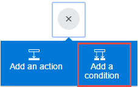
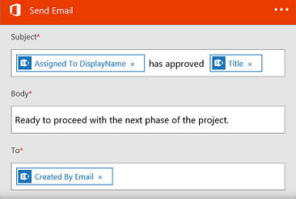

# Espera de la aprobación en Microsoft Flow
<iframe width="560" height="315" src="https://www.youtube.com/embed/W6oxcYRtW-8?list=PL8nfc9haGeb55I9wL9QnWyHp3ctU2_ThF" frameborder="0" allowfullscreen></iframe>

Cree un flujo que, si crea un elemento en SharePoint, envíe un mensaje de aprobación y, luego, le notifique si el elemento se ha aprobado o rechazado. Para seguir este tutorial con precisión, cree una lista simple de SharePoint como acción desencadenante, pero puede usar otro origen de datos, como Dropbox o OneDrive.

**Requisitos previos**

* Cree una lista simple de SharePoint Online simple denominado **Seguimiento de proyectos** con una columna denominada **Título** y agregue una columna de persona o grupo denominada **Asignado a**.
  
   

## Adición de un evento que desencadene el flujo
1. En [flow.microsoft.com](https://flow.microsoft.com), seleccione **Mis flujos** en la barra de navegación superior y, después, seleccione **Crear desde cero**.
   
    
2. En el cuadro **¿Cómo desea empezar?** escriba o pegue **nuevo elemento** y, después, seleccione **SharePoint Online - Cuando se crea un elemento**.
   
    
3. Si se le solicita, inicie sesión en SharePoint Online.
4. En **Dirección URL del sitio**, escriba o pegue la dirección URL del sitio que contiene la lista.
   
    
5. En **Nombre de lista**, seleccione una lista como **Seguimiento de proyectos**.
   
    

## Adición de la acción resultante
1. Seleccione el botón **+** y, luego, seleccione **Agregar una acción**.
   
    
2. En el cuadro **Buscar más acciones** escriba o pegue **enviar correo electrónico** y, después, seleccione **Office 365 Outlook - Send approval email**.
   
    
3. Si se le solicita, inicie sesión en Office 365 Outlook.
4. Seleccione el campo **A** y, después, seleccione **Asignado a correo electrónico**.
   
    El usuario de la columna **Asignado a** recibirá el correo para aprobar o rechazar el elemento. Cuando cree un elemento para probar el flujo, se especificará a usted mismo en este campo. De esa forma, no solo aprobará o rechazará el elemento sino que también recibirá el correo de notificación.
   
    **Nota**: puede personalizar los campos **Asunto** y **Opciones de usuario** para que se ajusten a sus necesidades.
   
    

## Adición de una condición
1. Seleccione el botón **+** y, luego, seleccione **Agregar una condición**.
   
    
2. En el campo **Nombre de objeto**, seleccione **SelectedOption**.
3. En el campo **Calor**, escriba o pegue **Approve**.
   
    
4. En el área **Si sí**, seleccione **Agregar una acción**.
   
    
5. En el cuadro **Buscar más acciones** escriba o pegue **enviar correo electrónico** y, después, seleccione **Office 365 Outlook - Send Email**.
   
    
6. En el cuadro **Asunto**, especifique un asunto.
   
    Por ejemplo, seleccione **Assigned To DisplayName**, escriba **ha aprobado** con un espacio en cada lado y, luego, seleccione **Título**.
7. En el cuadro **Cuerpo**, especifique un cuerpo del correo electrónico como **Listo para continuar con la siguiente fase del proyecto.**
8. En el campo **A**, escriba un destinatario como **Creado por correo electrónico**.
   
    A la persona que creó el elemento en la lista de SharePoint se le notificará si el proyecto se ha aprobado o rechazado.
   
    
9. En el área **Si no**, repita los últimos cinco pasos, excepto cambiar el contenido de los campos **Asunto** y **Cuerpo** para reflejar que el proyecto se ha rechazado.
   
     

## Finalización y prueba del flujo
1. Asigne un nombre al flujo y, luego, seleccione **Crear flujo**.
   
     
2. Cree un elemento en la lista de SharePoint.
   
    Se envía un correo de aprobación al destinatario especificado. Cuando el destinatario seleccione **Aprobar** o **Rechazar** en ese correo, usted recibirá correo electrónico que indica la respuesta. 

